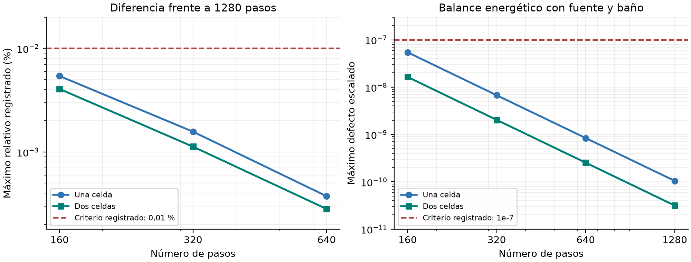
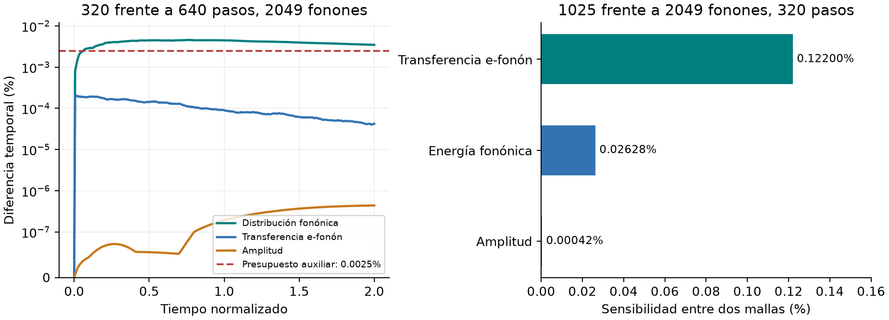

# Informe final de la etapa 2: celdas acopladas

Cierre de desarrollo y preparación de etapa 3 | 22 de septiembre de 2026

## Etapa 2 cerrada: celdas acopladas

<b>Decisión: cerrar esta etapa de desarrollo y avanzar al ensayo espacial con bordes y circuito.</b> La evidencia obtenida permite conservar los operadores cinéticos y la estrategia numérica, sin reformular ahora el modelo físico. El cierre tiene el alcance de los ensayos sintéticos de una y dos celdas.

| Resultado de cierre | Evidencia disponible |
| --- | --- |
| Último lote ejecutado | 21 tareas completas; 13 trayectorias válidas; 34 archivos fuente verificados |
| Ocupaciones físicas | Las 13 trayectorias mantienen electrones entre 0 y 1 y fonones no negativos |
| Balance energético | Máximo defecto escalado: 5,44e-8; criterio registrado: 1e-7 |
| Consistencia instantánea | Residuo máximo registrado: 1,64e-14 en los tiempos muestreados |
| Refinamiento temporal propio | Una y dos celdas pasan en la malla candidata de 630/1025 |
| Ensayo fonónico más fino | Trayectorias válidas; comparación auxiliar conserva su FAIL |
| Paso siguiente | Desarrollo espacial secuencial habilitado; implementación todavía no iniciada |

Qué queda disponible

Eventos electrón-fonón conservativos; transporte entre espectros distintos a energía fija; evolución del condensado y sus intercambios de energía; redistribución BGK, calentamiento y escape fonónico. El catálogo electrónico de etapa 1 se conserva como entrada. La malla complementaria seleccionada se usa explícitamente, sin reemplazar silenciosamente ese catálogo.

Alcance del cierre

Se acepta el paquete de desarrollo para construir la etapa 3. <b>No se declara completo el certificado dinámico de todas las mallas</b>, ni la calibración material de NbN, ni una predicción de pulsos del dispositivo. El solver de producción y el tag v1.0.0 permanecen preservados.

La decisión operativa cambia por el cierre solicitado; los resultados, los criterios originales y los fallos históricos quedan intactos. No se exige otra corrida larga para entregar esta etapa. Los datos ausentes se investigarán sólo si afectan una decisión concreta del ensayo siguiente.

## 1. La dinámica acoplada funciona en el ensayo

Las dos celdas parten con amplitudes y poblaciones distintas. Durante el intervalo normalizado de 0 a 2 evolucionan el condensado, las excitaciones y el intercambio entre celdas. La prueba incluye fuente externa y escape al baño; no es un estado estacionario trivial.

La energía electrónica de excitación se muestra separada de la fonónica. El transporte acumulado redistribuye energía interna. La contabilidad total incluye además el condensado y su trabajo. Estas trayectorias mantienen Gamma fijo; fase, potencial y trabajo espectral con Gamma(q) variable se comprobarán en etapa 3.

Se adopta 320 pasos como referencia económica de desarrollo para este ensayo de duración 2; 640 pasos permite contrastar su sensibilidad temporal. Esta elección no fija el paso temporal de una futura malla espacial.

## 2. Precisión medida y límite que permanece

Con 320 pasos, la diferencia máxima registrada frente a 1280 es <b>0,001570 % en una celda y 0,001126 % en dos</b>. Con 640 baja a 0,000374 % y 0,000282 %, respectivamente. El defecto del balance disminuye también al refinar; conservar energía y aproximar bien la trayectoria son controles distintos.

El par de 2049 fonones mide 0,004565 % frente al presupuesto auxiliar de 0,0025 %. Ese FAIL se conserva. La diferencia está principalmente en energías normalizadas superiores a 1, no en una cola infrarroja prescindible. Al cambiar 1025 por 2049 nodos, la amplitud cambia 0,000420 %, la energía fonónica 0,0263 % y el intercambio electrón-fonón 0,122 %.

## 3. La mejora necesaria fue numérica

El refinamiento electrónico de RK4 había producido una población no física en una etapa interna. Se adoptó SSPRK3 con factores comunes para cada evento conservativo. Después, una prueba aislada reveló un segundo problema: aritmética de números extremadamente pequeños, próxima al mínimo representable por float64.

La corrección usa aritmética ampliada para inventarios y flujos sólo cerca del subdesbordamiento. No recorta poblaciones ni repara la energía después de integrar. En las 13 trayectorias finales no se activó esa protección ni el limitador: la rama ordinaria produjo los resultados. Los controles aislados comprueban la rama protegida cuando sí se necesita.

| Costo registrado en Geminga | Una celda | Dos celdas |
| --- | --- | --- |
| 320 pasos | 3,28 min | 6,45 min |
| 640 pasos | 6,54 min | 12,89 min |
| 1280 pasos | 13,02 min | 25,72 min |

El último lote terminó a los 94,5 minutos, con 21 de sus 35 tareas completas. La siguiente optimización debe reducir el costo de evaluar eventos y reutilizar datos compatibles antes de multiplicar celdas. El tiempo de una o dos celdas no permite prometer el costo del detector completo.

El prototipo protegido requiere un tipo longdouble con mayor alcance que float64, disponible en Geminga. Los entornos sin esa capacidad se rechazan explícitamente. Esta dependencia debe resolverse o mantenerse declarada al promover el integrador.

## 4. El circuito previsto es el de la memoria

Se fija la red usada en los resultados de la memoria, sección 4.4.1, ecuación 4.16. Sus estados son la corriente de polarización, la corriente total del ramal del detector y el voltaje del capacitor. La producción ya contiene estas tres ecuaciones; el nuevo acoplamiento espacial las reutilizará con un puerto de energía consistente.

En este ejemplo, la red de la memoria alcanza 0,738 mV frente a 0,750 mV con la fuente ideal y presenta una cola negativa de -0,380 mV. La diferencia justifica mantener la red completa para comparar formas de pulso. La identidad instantánea de potencia cierra con residuo escalado de 3,19e-16.

| Decisión de acoplamiento | Consecuencia para etapa 3 |
| --- | --- |
| Corriente y voltaje con signo pasivo | El mismo producto I·V entra en las cuentas del dispositivo y del circuito con signos opuestos |
| Puerto sobre todo el dominio resuelto | El voltaje central de 100 nm queda como diagnóstico separado |
| Inductancia exterior identificada una vez | No sumar otra vez la energía inductiva ya resuelta en el dominio |
| Tres estados continuos al depositar energía | Inicializar el régimen estacionario antes de la perturbación |

Referencia histórica: Rb = 10 kohm, Lb = 1 microhenrio, RL = 50 ohm, Cc = 100 pF, Vbias = 0,300 V y Lk total = 10 nH. Los 10 nH son totales; no se asignan automáticamente al exterior del nuevo dominio. Ecuaciones y signos completos: adenda CM.1-CM.11.

## 5. Etapa 3 preparada: espacio, bordes y circuito

<b>Objetivo siguiente:</b> resolver un ensayo espacial dentro del dominio admitido del modelo, incluyendo terminales, intercambio con reservorios y la red circuital de la memoria. La etapa está preparada; aún no hay un resultado espacial nuevo.

| Secuencia de implementación | Salida que permite continuar |
| --- | --- |
| 3A. Energía y campos espaciales | Energía, fuerza y corriente coherentes; prueba uniforme y perturbaciones pequeñas; dominio de estabilidad declarado |
| 3B. Bordes y reservorios | Balance de carga y energía con flujos de entrada y salida; caso abierto distinguido del control periódico |
| 3C. Potencial y corriente | Continuidad de carga, signos de terminales y voltaje del dominio con referencia de potencial definida |
| 3D. Circuito de la memoria | Régimen estacionario acoplado, tres estados circuitales, puerto pasivo y reparto de inductancia |
| 3E. Ensayo dinámico admitido | Respuesta débil y depósito localizado; balance global y precisión de los observables registrados |

La progresión exige comprobaciones propias de cada acoplamiento, no repetir automáticamente el lote de etapa 2. Se conserva el control negativo D.36: si la respuesta espacial pierde estabilidad en el estado probado, debe detectarse y excluirse ese dominio. No se oculta esa limitación refinando una malla.

Antes de una corrida espacial costosa se fijan geometría, excitación, ventana temporal y precisión útil de amplitud, energías, corriente y voltaje de salida. El error numérico debe permitir decidir sobre la respuesta del dispositivo. Un umbral auxiliar previo no se convierte en requisito universal.

Entrega y reproducción

El cierre se registra en stage2/closure_20260922/closure_decision.json; la entrada y secuencia en stage3/entry_contract.json. Los datos originales, incluidos el FAIL y las tareas ausentes, permanecen en stage2/practical_review_20260922/raw/. saved_results_audit.json verifica los archivos y conserva las comparaciones. verify_delivery.py comprueba la entrega sin integrar trayectorias.

La libreta /home/jdiaz/GEMINGA_COMMANDS.md queda sin corridas largas pendientes de esta etapa y sin instrucciones de screen. Los cálculos futuros de más de cinco minutos se prepararán allí para ejecución del usuario. El informe se regeneró con datos guardados, sin nuevas evaluaciones físicas.
