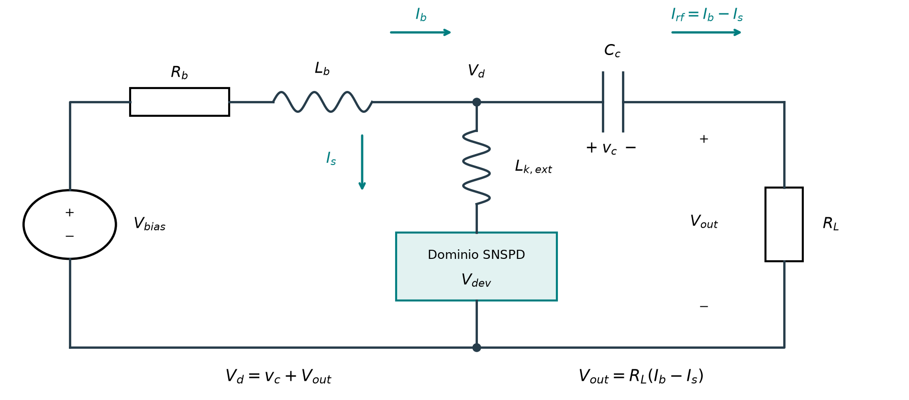

# Etapa 2: revisión de criterios y circuito previsto

Resultados auditados y actualización documental | 22 de septiembre de 2026

## El fallo fue de precisión auxiliar

<b>No era necesario usar ese fallo como bloqueo general de la implementación.</b> La auditoría verifica 21 tareas completas, 34 fuentes y 13 trayectorias. Todas mantienen poblaciones físicas y balances válidos. El limitador y la protección de subnormales no actuaron en estas corridas.

| Qué se midió | Resultado |
| --- | --- |
| Convergencia temporal propia ONE/TWO | PASS en la malla candidata |
| Par 320/640 con 2049 fonones | 0,004565 % frente al presupuesto de 0,0025 % |
| Máximo defecto energético de las 13 trayectorias | 5,44e-8; criterio registrado: 1e-7 |
| Máximo residuo instantáneo de balance | 1,64e-14 |

El fallo está en la distribución fonónica ponderada, en t = 0,76875. El 99,997 % de esa diferencia está en la primera celda y predomina por encima de energía normalizada 1. <b>No es una cola infrarroja que podamos descartar para hacerlo pasar.</b>

La sensibilidad de malla sí aporta información útil: cambia muy poco la amplitud, mientras el intercambio electrónico-fonónico varía 0,122 %. Esto orienta futuros refinamientos sin confundir conservación exacta con precisión física del detector.

## Verificaciones proporcionales al trabajo

El umbral auxiliar 2,5e-5 se eligió para separar error temporal y de malla. No es una constante física ni una resolución experimental requerida. Su elección y el bloqueo general fueron decisiones de los agentes; no se atribuyen al usuario.

| Control | Decisión vigente | Por qué |
| --- | --- | --- |
| Unidades, signos y energía compartida | Se conserva | Detecta errores de modelo o implementación |
| Poblaciones y dominio del catálogo | Se conserva en cada estado usado | Asegura evaluar el modelo declarado |
| Energía, derivadas y estabilidad espacial D.36 | Necesario para 3A | Una inestabilidad estructural no se arregla relajando tolerancias |
| Par temporal 0,0025 % | FAIL histórico preservado; deja de bloquear todo | Presupuesto auxiliar, no requisito de una prueba estática |
| Precisión dinámica del dispositivo | Se registra por observable antes de nuevas corridas | Debe resolver una diferencia física relevante |
| Repetición de trayectorias | Sólo con una razón concreta | Se reutilizan resultados compatibles |

<b>Siguiente paso preparado: 3A estática.</b> Construir energía espacial, fuerzas y corriente con ocupaciones congeladas; verificar las derivadas y el dominio de estabilidad. No requiere integrar colisiones ni reproducir otra vez las referencias temporales.

La certificación dinámica completa de etapa 2 permanece abierta. No se modifica el criterio histórico ni se cambia su FAIL a PASS. La nueva organización permite trabajo independiente con un contrato estático propio; aquí queda preparado, no implementado.

<b>No se recomienda otro lote largo ahora.</b> La libreta de Geminga conserva el historial y ofrece sólo comprobaciones ligeras. Antes de un pulso espacial habrá que fijar el observable, su incertidumbre numérica y los datos del dispositivo.

## El modelo previsto recupera el circuito de la memoria

Se selecciona la red usada en los resultados de la memoria, sección 4.4.1, ecuación 4.16. El código de producción ya contiene sus tres ecuaciones; el plan 0.4 había retenido la simplificación conceptual de fuente de corriente ideal.

| Variable dinámica | Ecuación continua |
| --- | --- |
| Corriente Ib | Lb dIb/dt = Vbias - Rb Ib - vc - RL (Ib - Is) |
| Corriente Is | Lk,ext dIs/dt = vc + RL (Ib - Is) - Vdev |
| Voltaje vc | Cc dvc/dt = Ib - Is |

Las salidas distinguen voltaje del detector, del nodo, del capacitor y de la carga. La inicialización estacionaria impone Ib = Is, vc = Vdev y Vbias = Rb Is + Vdev. Las tres variables se mantienen continuas al depositar el fotón.

La adenda normativa CM.1-CM.11 sustituye C.32-C.34, D.28-D.29, D.33 y la inicialización circuital de D.30. Los C/D y PDF previos permanecen históricos; MODELO_VIGENTE.md identifica la actualización. No se modifica el solver de producción.

## Qué cambia en la señal y cómo se acoplará

La red completa produce una cola de signo opuesto que la fuente ideal no reproduce. En este ejemplo, el máximo de carga es 0,738 mV frente a 0,750 mV, y el mínimo es -0,380 mV. Cambian la rama de polarización y el acoplamiento capacitivo: la comparación no aísla un solo componente.

El diagnóstico usa propagación por exponencial de matriz en cada tramo. La identidad instantánea de potencia tiene residuo escalado 3,19e-16. Ese número comprueba la contabilidad circuital; no constituye validación experimental ni convergencia de un detector.

| Acoplamiento al modelo nuevo | Decisión documentada |
| --- | --- |
| Signo de corriente y voltaje | Adaptar ambos juntos a la orientación del puerto; nunca usar valores absolutos |
| Trabajo eléctrico del dominio | Vdev abarca la región cuya energía se contabiliza; voltaje central de 100 nm como salida separada |
| Inductancia | Los 10 nH de la memoria son una referencia total: identificar la parte exterior para no duplicar energía |
| Energía del circuito | Sumar Lb Ib²/2, Lk,ext Is²/2 y Cc vc²/2; registrar fuente y pérdidas en ambas resistencias |

El circuito queda decidido. La partición geométrica de inductancia se identifica antes de una simulación acoplada; no se ajusta mirando el pulso ni se resta dinámicamente una inductancia de hotspot. Referencia histórica: Vbias = 0,300 V y Lk total = 10 nH.
