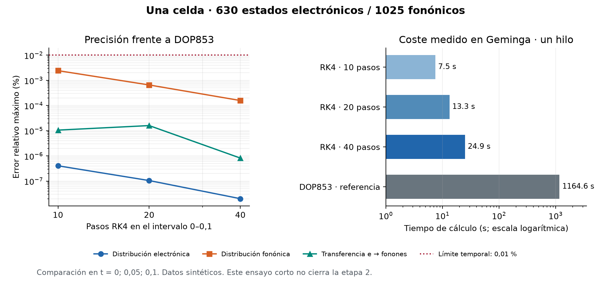

# Etapa 2: continuación después de la referencia manual

**La referencia terminó; la etapa completa aún no está admitida.** Se recuperó
la salida de `3040582.code_000` y los archivos originales sin modificarlos.
El historial está en `manual_reference/screen_capture_resume_1.txt`; no hace
falta copiar sus miles de caracteres al chat.

## Resultados que cambian la decisión numérica

| Control | Resultado | Interpretación |
|---|---:|---|
| DOP853 manual, una celda, t = 0,1 | 1164,55 s; 6843 RHS | Referencia independiente completa |
| RK4, 10 / 20 / 40 pasos | 7,47 / 13,27 / 24,94 s | Tres trayectorias completas comparables |
| Mayor error RK4 de 40 pasos | 1,5747 × 10⁻⁶ | Pasa el límite 10⁻⁴ en los tres tiempos comunes |
| Reducción del error al refinar | 3,70 / 4,15 | Convergencia medida; no se supone orden cuatro |
| Comparación continua exacta 630/1025, corte 0,005 | Máximo 7,3653 × 10⁻⁴ | Pasa el límite estático 10⁻³ |
| Dos celdas, t = 2, RK4 de 40 pasos | 46,01 s | Piloto completo en la configuración seleccionada |
| Balance energético del piloto | 1,1178 × 10⁻⁸ | Menor que 10⁻⁷; aún falta convergencia temporal |
| Campos y fuerzas a lo largo del piloto | 22 muestras; PASS | Identidad de derivada: 5,39 × 10⁻¹¹ |
| Cota de absorción fuera del soporte | 6,67 × 10⁻¹⁰ | Menor que 10⁻³ en los puntos examinados |

Se conserva RK4 para esta etapa y se valida por refinamiento. El ensayo fino
fue 46,7 veces más rápido que DOP853, dentro del presupuesto de error físico.
Esto no promete la misma aceleración en un transiente de detector completo.
El diagnóstico de 17 evaluaciones estáticas detectó cambios de pendiente y
sensibilidad de nodos de capacidad diminuta; no probó ausencia de rigidez en
todo el sistema. Véase `RHS_DIAGNOSIS.md`.

Las ecuaciones, los kernels, la malla candidata y los umbrales permanecen
iguales. Los verificadores ahora impiden admitir una malla gruesa sólo porque
su siguiente refinamiento pasa, controlan el balance instantáneo de todos los
niveles temporales y exigen al menos diez tiempos distintos para campos y
soporte. Sus 26 controles, incluidos casos negativos, pasaron.

## Qué falta

La referencia manual sólo almacena tres tiempos hasta t = 0,1. No sustituye
los casos completos de una y dos celdas hasta t = 2, los refinamientos de
malla, el equilibrio y las trayectorias desde las fronteras de ocupación.
La certificación final seguirá pendiente hasta revisar esas salidas.

El lote `manual_validation_plan.json` registra las ejecuciones y verificadores
antes de lanzarlos. Primero exige la convergencia temporal; sólo después
construye las mallas más costosas. Reutiliza el piloto de dos celdas únicamente
si coinciden datos, parámetros, fuentes y versiones. Se detiene ante el primer
fallo y no reintenta ni altera una salida incompleta.

El comando de ejecución manual y los recursos están en `command_addendum.md`
y en `/home/jdiaz/GEMINGA_COMMANDS.md`. El agente no ejecutó ese lote. Los
artefactos anteriores, incluidos los ensayos fallidos, se conservan.
