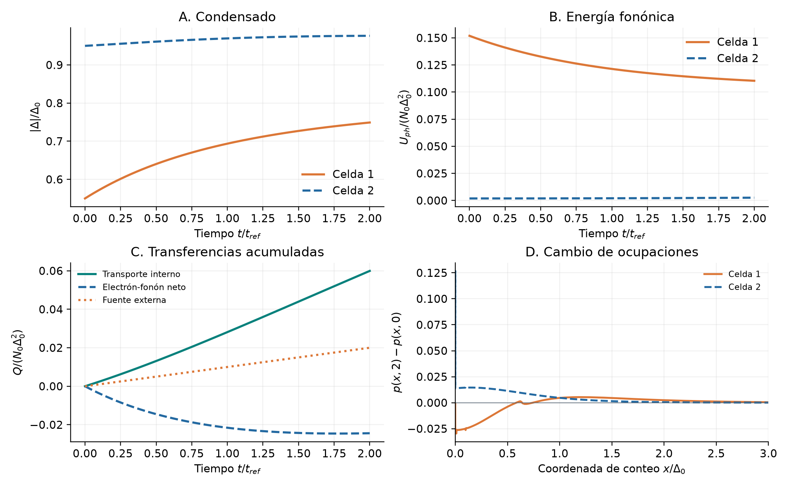

# Etapa 2 - Revisión de resultados

22 de septiembre de 2026 | Cierre no admitido | Resultados y próxima comprobación

## Etapa 2 | Revisión de resultados

<b>Dictamen: todavía no procede cerrar la etapa 2.</b> La precisión temporal RK4 en la malla candidata se repitió con éxito. Persisten un fallo de positividad en la malla electrónica fina y un fallo de precisión energética en el ensayo SSP completo. Se conserva toda la evidencia, incluidos ambos fallos.

| Control | Resultado medido | Dictamen |
| --- | --- | --- |
| Tiempo RK4: una celda | 6.1436e-05 / límite 1e-4 | Pasa en 630 estados |
| Tiempo RK4: dos celdas | 4.7400e-05 / límite 1e-4 | Pasa en 630 estados |
| RK4: malla de 2520 estados | Ocupación negativa en una etapa | Falla; ensayo incompleto |
| SSP: energía, 40 pasos | 3.6522e-06 / límite 1e-7 | Falla: 36,5 veces el límite |
| SSP: balance instantáneo | 1.603e-15 / límite 1e-10 | Pasa; no acredita integración |
| Convergencia de mallas completa | No alcanzada por los lotes | Pendiente |

Qué se recuperó

Se archivaron 73 archivos de los lotes y diagnósticos nuevos, con comprobación de hashes contra Geminga. Una auditoría independiente pasó 118 verificaciones de archivos, contratos y resultados. Estas verificaciones acreditan la procedencia del dato; no convierten un ensayo fallido en una validación del modelo.

El nuevo lote RK4 se detuvo tras unos 29,3 minutos, en la misma prueba fina que el lote anterior. La recuperación SSP terminó su primera trayectoria en 25,8 segundos y se detuvo al evaluar el balance energético. Ninguno de esos bloqueos se debe a omitir instrucciones de manejo de terminales.

El cálculo estático de comparación continua volvió a pasar. Su único cambio frente al archivo anterior es el tiempo de ejecución. El diagnóstico de suavidad del RHS describe muestras estáticas y no sustituye la convergencia del transiente.

Alcance: una o dos celdas sintéticas con malla candidata de 630 estados electrónicos y 1025 fonónicos. Las tasas absolutas de NbN, el circuito y los transientes completos del detector siguen fuera de esta validación.

## Qué sí pasó: precisión en la malla candidata

La disminución del error temporal se reproduce al usar 40, 80 y 160 pasos. En una celda las reducciones son 2,16 y 2,99; en dos celdas son 3,02 y 3,03. El criterio exige al menos 1,5 y un error final menor que 1e-4. Los dos casos cumplen en la malla candidata.

Ese resultado no demuestra independencia de la malla. El refinamiento electrónico de 1260 estados terminó, pero el de 2520 volvió a salir del dominio físico. Los refinamientos fonónicos todavía no se ejecutaron en el lote.

La prueba corta SSP había pasado frente a DOP853, y el primer intervalo de la malla fina mantuvo ocupaciones físicas. El fallo posterior muestra por qué esos ensayos locales eran requisitos preliminares y no una aceptación del transiente completo.

## Qué produce el sistema acoplado

La amplitud de la primera celda pasa de 0,55 a 0.7491; la segunda pasa de 0,95 a 0.9763. El transporte acumulado alcanza 0.05994, y la transferencia electrón-fonón neta suma -0.02441, en las unidades de energía declaradas.

La transferencia electrón-fonón negativa representa energía neta desde los fonones hacia los electrones. El transporte es un intercambio interno: no se añade otra vez al balance global. La fuente externa inyecta 0,02 en el intervalo representado.

Estos resultados muestran actividad simultánea del condensado, las distribuciones y el transporte. Las estructuras de las ocupaciones a baja energía todavía requieren la convergencia de malla pendiente. Son resultados del ensayo sintético, no una predicción aceptada de latencia o respuesta de un SNSPD.

Escalas: tiempo t/t_ref de ensayo, amplitud |Delta|/Delta0 y energía normalizada por N0 Delta0². La coordenada de conteo x identifica los estados electrónicos; el gráfico no introduce una nueva DOS.

## El bloqueo numérico y la continuación

En SSP40 el limitador no actuó en ninguna de las 116.949.055 evaluaciones de eventos. El defecto de flujo registrado es cero y las poblaciones permanecen en su dominio físico. El exceso de energía es compatible con error temporal del método aplicado al condensado móvil; este resultado no prueba una inconsistencia en las transferencias instantáneas del modelo. La decisión es continuar con la validación numérica: estos resultados no justifican por sí solos reformular las ecuaciones físicas.

Siguiente cálculo único

Se dejó preparado un control de <b>una celda</b> con 160, 320 y 640 pasos, frente a una referencia separada de 1280 pasos. El coste estimado es de unos 26 minutos, un hilo y una reserva de 2 GiB. Lo ejecuta el usuario desde un único comando de GEMINGA_COMMANDS.md; en esta revisión no se lanzó dinámica nueva.

Primero debe pasar ese control temporal. Después corresponde verificar dos celdas, las tres mallas electrónicas y fonónicas, equilibrio y fronteras de población, y campos y soporte a lo largo de las trayectorias finales. No se avanza a la etapa espacial ni a producción con estos criterios pendientes.

Archivos de respaldo: independent_audit.json, diagnosed_ssp.json, import_inventory.json y raw/. Los umbrales originales se mantienen; el historial y v1.0.0 se conservan. El cuaderno activo elimina la gestión de sesiones y separa su histórico de la única continuación vigente.
