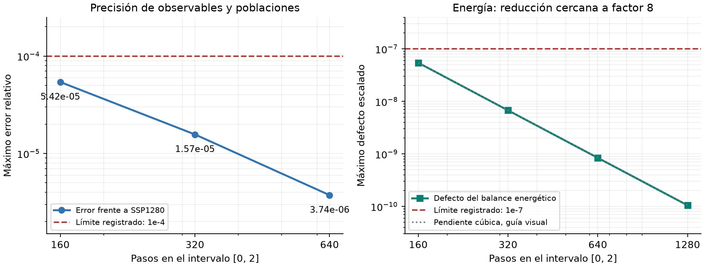

# Etapa 2 - Resultado del lote temporal

Conclusión del lote de una celda | 22 de septiembre de 2026 | Admisión global pendiente

## Una celda: tiempo validado

<b>El lote termina correctamente y supera 85 de 85 controles de auditoría.</b> Las tres resoluciones medidas cumplen por separado el criterio de precisión temporal y de balance de energía. La etapa 2 completa sigue pendiente: este lote sólo ensaya una celda en la malla candidata.

| Pasos | Error máximo frente a 1280 | Defecto energético | Tiempo (s) |
| --- | --- | --- | --- |
| 160 | 5.416e-05 | 5.438e-08 | 98.4 |
| 320 | 1.570e-05 | 6.741e-09 | 195.8 |
| 640 | 3.742e-06 | 8.392e-10 | 390.2 |
| 1280 | Referencia | 1.046e-10 | 776.1 |

Al duplicar los pasos, el error de la solución disminuye por factores <b>3,45 y 4,20</b>; el defecto energético disminuye aproximadamente por 8. El resultado rescata SSP160 para este escenario. El fallo anterior de SSP40 se conserva como evidencia y no se ha relajado ninguna tolerancia.

Lote: stage2_ssp_time_20260922; duración total 24,37 min en Geminga. Malla: 630 estados electrónicos y 1025 nodos fonónicos; intervalo t/t_ref = 0 a 2; Debye sintético; sin escape ni calentamiento externo.

## Qué muestran las trayectorias

La amplitud pasa de <b>0,600000 a 0.759347</b>. La energía se redistribuye entre el sector electrónico y los fonones con un defecto global pequeño. El panel de diferencias hace visible la separación entre curvas que parecen idénticas al superponerlas.

<b>El limitador de eventos estuvo inactivo en las cuatro corridas.</b> Las ocupaciones electrónicas permanecieron entre 0 y 1 y las fonónicas fueron no negativas, sin recortes ni reparación energética. Este resultado no comprueba el régimen fino con limitación activa.

Dos controles posteriores sobre SSP160 también pasan: energía y fuerzas en 11 tiempos físicos (defecto de identidad derivativa 5,07e-11), y soporte superior (cota relativa máxima 9,28e-10). No sustituyen la comprobación de las futuras trayectorias de dos celdas.

Las escalas de tiempo y energía son las declaradas por el ensayo sintético. No se infieren latencias absolutas de NbN, pulsos de salida ni comportamiento de un detector espacial completo. La forma de la DOS y los núcleos físicos no cambiaron en esta revisión.

## Dictamen y trabajo restante

| Bloque | Resultado actual | Acción necesaria |
| --- | --- | --- |
| Una celda / tiempo SSP | Aprobado para 160, 320 y 640 pasos | Conservar estas corridas; no repetir. |
| Dos celdas / tiempo SSP | Pendiente | 160/320/640 frente a 1280, más control pareado para las futuras mallas. |
| Mallas de energía | Pendiente | Tres mallas electrónicas y tres fonónicas; controlar el error temporal de cada malla. |
| Equilibrio y poblaciones límite | Pendiente | Comprobar estacionariedad del sistema completo y fronteras en canales aislados. |
| Campos y soporte | Una celda: aprobado. Dos celdas: pendiente | Al menos 10 tiempos distintos por celda; incluir referencia causal para cada campo empleado. |
| Etapa 3 espacial | Preparada, no iniciada | Entrada condicionada a la admisión global de etapa 2. |

Decisión

La evidencia nueva respalda continuar con el método numérico candidato. No aporta una razón para reformular las ecuaciones físicas. Tampoco permite declarar cerrada la etapa 2: una prueba temporal aprobada no sustituye la convergencia de malla ni los casos de dos celdas y frontera.

El siguiente comando manual ensaya dos celdas; se estima entre 45 y 65 minutos con un hilo. No se inicia una cadena costosa de mallas hasta conocer el paso temporal admisible en ese sistema. El plan completo de pendientes identifica además las comprobaciones que necesitan ampliar sus evaluadores; no se presentan como ensayos ya preparados o aprobados.

Entrega y trazabilidad

Informe editable y figuras: docs/implementation/stage2/time_pass_20260922/. Auditoría: one_cell_audit.json. Resultados originales: raw/. Criterio vigente: stage2/acceptance_criteria.json. Estado global: stage2/stage2_admission.json. Preparación espacial: stage3/README.md y entry_contract.json. El push de cierre solicitado queda pendiente del cumplimiento global; los archivos de trabajo se sincronizan con Geminga.

Se preservan el catálogo R2, los archivos físicos que originaron las corridas, los fracasos anteriores y v1.0.0. Esta revisión usa postprocesamiento; no ejecuta nuevas trayectorias.
