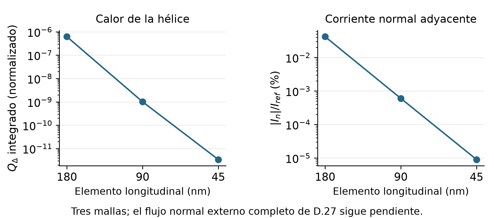

# Etapa 3: cierre de desarrollo y apertura de 3.5

Informe final de resultados · 23 de septiembre de 2026 · Modelo 0.4 experimental

## Etapa 3: desarrollo cerrado

Se cierra el desarrollo espacial disponible, conforme a la decisión de alcance acordada. La energía común, el empalme de campo 2D–1D, el potencial, el condensado y el circuito de la memoria ya se evalúan conjuntamente en estados instantáneos. Queda preparada la investigación 3.5 de parámetros y límites físicos.

| Resultado | Evidencia de esta entrega |
| --- | --- |
| Lote completado | 6 estados: hélice y perturbación suave en tres mallas. 355,65 s (5,93 min), ejecutados por el usuario. |
| Integridad y balances | 61 archivos conservados; auditoría sin incidencias. Residuo máximo recompuesto de CM9: 2,04 × 10⁻²⁵ W. |
| Regresión focalizada | 243 pruebas y 46 subpruebas aprobadas en 10,29 s en Geminga. |
| Alcance | Cierre de desarrollo; la trayectoria espacial acoplada y la admisión del dispositivo siguen pendientes. |

El diagnóstico de los extremos dio un resultado útil

El control con extremos libres producía calor dominado por el borde. Al introducir la carga prescrita del reservorio y contabilizar su trabajo, la respuesta residual de la hélice disminuye claramente al refinar. La perturbación interior conserva una respuesta finita.

Geometría del piloto: región 2D de 360 × 120 nm, espesor 7 nm y dos continuaciones de 180 nm. Elementos longitudinales de 180/90/45 nm, grado 4. Son valores de ensayo; todavía no se adoptan para representar el experimento.

## Respuesta interior y siguiente límite

| Observable | Cambio media → fina |
| --- | --- |
| Calor total de la perturbación | 0,044 % |
| Máxima velocidad material | 0,968 % |
| Exceso de energía respecto a la hélice | 0,108 % |
| Exceso de voltaje respecto a la hélice | 0,051 % |

La comparación es favorable para continuar el desarrollo. El exceso de voltaje fino es 0,649 nV en este ensayo débil: no representa un pulso de detección. Estos porcentajes describen sensibilidad observada, sin introducir un umbral retrospectivo ni convertirlos en cotas del error temporal.

Qué se conserva para las etapas siguientes

Se conserva la energía discreta común con sus fuerzas y corriente, el empalme de traza uniforme, el circuito de tres estados de la memoria y el acelerador que propone una semilla y luego resuelve el problema causal original. El factor 1,904 medido antes corresponde al kernel espectral; no es una aceleración demostrada de un transiente completo.

Requisitos pendientes antes de las etapas 4–5

Faltan la evolución débil conjunta del condensado, poblaciones y circuito; el reservorio dependiente de la corriente con su trabajo dinámico; el transporte cinético a igual energía en la unión; y la influencia temporal de los bordes y la longitud. La reducción a 1D necesita evidencia de uniformidad transversal durante el transiente.

Los dictámenes originales y sus fallos quedan intactos. En particular, los archivos del lote conservan stage3_closed=false: la decisión posterior cierra el desarrollo con límites explícitos y no cambia el alcance científico de esos datos. Producción y v1.0.0 no se modifican.

## Etapa 3.5: dominio de confianza

Se inicia la investigación de los rangos y márgenes físicos y numéricos que permitirán interpretar las etapas 4–5. Esta entrega contiene 127 entradas en 15 familias, con valores utilizados, unidades, procedencia, acoplamientos y preguntas pendientes. No se han adoptado rangos finales ni ejecutado una nueva campaña de simulaciones.

| Área | Decisión que debe fundamentarse |
| --- | --- |
| Material y espectro | Muestra, Tc, gap, difusión, conductividad, DOS, tasas y límites del cierre. Separar mediciones de ajustes y supuestos. |
| Fotón y geometría | Energía retenida, estado inicial, ancho y posición; región 2D, continuaciones, distancias a bordes y ventana de observación. |
| Circuito y lectura | Parámetros del circuito de la memoria y partición de inductancia. Distinguir latencia, señal, electrónica y jitter. |
| Resolución y coste | Mallas espaciales y espectrales, pasos temporales, interpolación, tolerancias y coste ligados a observables concretos. |

Referencia principal: Korzh et al. (2020)

El experimento sub-3 ps usa NbN nominalmente de 7 nm, una región activa de 5 µm y baño de 0,9 K. La resolución temporal del sistema no es un paso de integración ni una latencia determinista. Los parámetros de su modelo suplementario y los distintos escenarios de Allmaras se registran por separado; no se mezclan como si fueran mediciones de una misma muestra.

Longitud útil, hotbelt y bordes

La propuesta L2D/W = 1,5–6 queda como ejemplo para estudiar. La longitud física de 5 µm no impone que toda ella se resuelva en 2D. Se investigará cuánto dominio requiere observar la formación de una franja excitada transversal y cuánto margen evita que los extremos alteren el observable. Las colas difusivas existen desde el inicio: el criterio será su influencia, no un instante de llegada abrupto.

Primer trabajo de 3.5: elegir un escenario material y de lectura coherente, resolver discrepancias entre parámetros heredados y documentar propuestas de rango con sus límites. No hay ningún cálculo largo pendiente para iniciar esa investigación.

Fuentes primarias: <link href='https://doi.org/10.1038/s41566-020-0589-x' color='#007c83'>Korzh et al., Nature Photonics (2020)</link>; <link href='https://eprints.lancs.ac.uk/id/eprint/140252/3/Binder1.pdf' color='#007c83'>manuscrito y suplemento</link>; <link href='https://doi.org/10.7907/wgak-vs11' color='#007c83'>Allmaras, tesis (2020)</link>. El registro de fuentes de 3.5 identifica las páginas y separa las versiones del artículo.

Trazabilidad: full_reservoir_review.json, checks.json y closure_decision.json contienen la evidencia de cierre. stage3_5/parameter_inventory.json, reference_experiment.md y research_plan.md contienen la base de investigación. El nuevo verificador preserva también las entregas anteriores.
