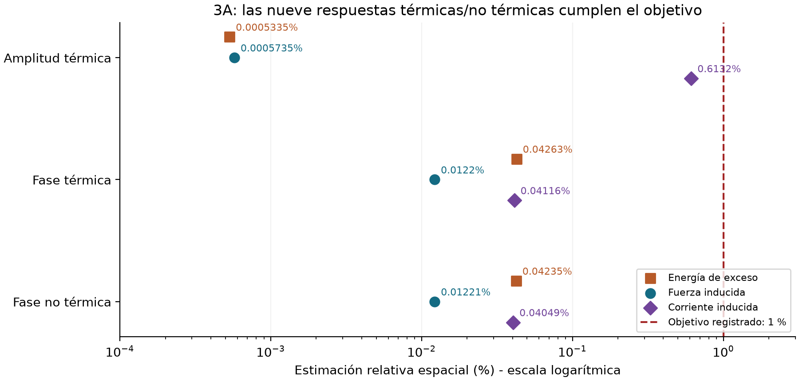
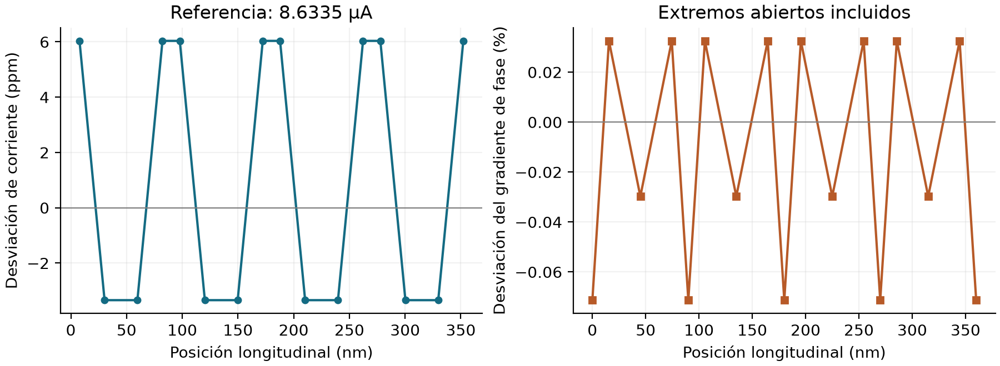

# Etapa 3: de la malla a los bordes

Informe de avance con resultados · 23 septiembre 2026 · Modelo 0.4 experimental

## 3A completado; etapa 3 en desarrollo

<b>La nueva discretización supera el problema de precisión del ensayo anterior.</b> Los 18 casos finalizaron en 7,85 minutos. La auditoría verificó ocho fuentes, 76 archivos y 336 nodos. Hay diez estimaciones relativas aceptadas, ninguna fallida y una diferencia demasiado pequeña para dar un certificado relativo.

La peor estimación es <b>0,613 % en corriente</b>, por debajo del objetivo de 1 %. Su orden observado es 0,608: permite continuar el desarrollo en este alcance, pero debe revisarse si cambia la geometría o el estado. La energía de exceso del caso vacío conserva el dictamen <b>sin certificado relativo</b>: diferencia 1,835e-9 frente al piso registrado de 1e-8.

| Comprobación independiente | Resultado |
| --- | --- |
| Gradiente espacial frente a referencia analítica | 0,001646 % en la malla fina |
| 12 contrastes espectrales: 630 / 1260 nodos | Signo positivo conservado; cambio máximo de matriz 4,05e-9 |
| Estado de control físicamente inestable | Rechazado como se esperaba |
| Nuevos módulos y regresiones en Geminga | 168 pruebas y 23 subpruebas pasaron; 9,87 s |

La primera campaña permanece archivada con sus fallos. Este cierre de desarrollo de 3A no declara terminado el detector espacial ni promueve el modelo a producción.

## Bordes abiertos: primer piloto físico

Se implementó un tramo abierto de 360 nm con 17 nodos. Los reservorios fijan la amplitud mediante el equilibrio de la misma energía; la corriente se impone por su trabajo en el borde. El piloto térmico pasó en <b>20,9 segundos</b> con corriente de referencia <b>8,634 µA</b>.

| Observable | Piloto | Objetivo |
| --- | --- | --- |
| Error máximo de corriente | 0.000603 % | 1 % |
| Error del gradiente en extremos | 0.07130 % | 1 % |
| Residuo estacionario normalizado | 1.94e-05 | 0,0001 |
| Amplitud / escala del catálogo | 0.99521819 | Rama estable |
| Inductancia resuelta / exterior fija | 0.1666 / 9.8334 nH | Total de referencia: 10 nH |

La hélice inicial ya satisface la tolerancia: <b>cero iteraciones de relajación</b>. Este resultado comprueba consistencia del equilibrio y sus bordes, no demuestra relajación de un pulso. El intercambio electrónico con un baño fijo pasó pruebas de equilibrio, soporte y balances; las ocupaciones se comparan a la misma energía física.

La partición de inductancia corresponde a esta longitud y a esta rama. Se fija antes de la dinámica. El sesgo de este piloto débil es distinto de los 30 µA históricos. Falta contrastar longitudes y resoluciones; tampoco se ha resuelto todavía la interfaz 2D-1D.

## Circuito de la memoria y siguiente ejecución

Están implementados el potencial con continuidad de corriente y los tres estados circuitales de la memoria: corriente de polarización, corriente del dispositivo y tensión del condensador. El control independiente impone un salto de resistencia de 0 a 1000 ohmios y compara la integración con una solución matricial exacta.

La diferencia máxima en la salida es <b>6.45e-14 V</b>. El balance instantáneo de potencia y la invariancia frente al origen del potencial pasan. Las pruebas incluyen que el trabajo del puerto tiene el mismo signo y magnitud en dispositivo y circuito.

<b>Siguiente paso preparado:</b> seis equilibrios abiertos con longitudes 360, 720 y 1080 nm, dos resoluciones por longitud. Estimación: 6-10 minutos, un núcleo, menos de 1 GB de RAM. El comando está en <b>/home/jdiaz/GEMINGA_COMMANDS.md</b>, con barra de avance y ETA; debe ejecutarlo el usuario según la política acordada.

Tras revisar ese lote siguen el empalme 2D-1D y el ensayo débil acoplado en el tiempo, con sus balances y observables. No se requieren repetir los lotes estáticos ya aceptados sin que haya cambios. Datos, criterios previos, fuentes y pruebas: docs/implementation/stage3/ports_20260923/.
