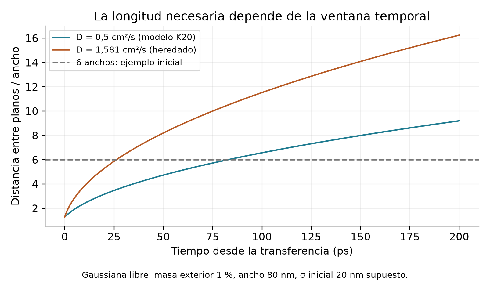
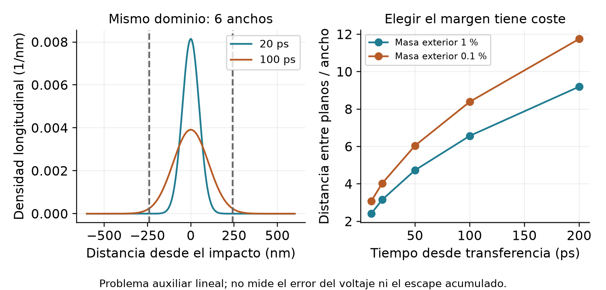

# Geometría, escalas y márgenes numéricos

Investigación del 23 de septiembre de 2026. El usuario eligió priorizar el hilo
de 80 nm de Korzh, la comparación 775/1550 nm y la formación de hotbelt. Las
propuestas siguientes preparan ensayos; no son resultados de transientes ni
rangos materiales ya validados.

## Qué longitud estamos escogiendo

El ancho W cruza la cinta; L2D mide la porción longitudinal resuelta en dos
dimensiones. Lres incluye cualquier continuación hasta los planos terminales.
Los 5 µm del dispositivo de Korzh son una longitud física, distinta de esas
elecciones de discretización. Mantener el dispositivo exige conservar también
el almacenamiento eléctrico de la parte no resuelta.

La longitud no se selecciona sólo por L2D/W. Importan la posición del impacto,
el ancho de la excitación y cuánto tiempo queremos observar. La hotbelt es una
región excitada que abarca el ancho; su formación no exige que todas las
variables sean exactamente uniformes en esa dirección.

El artículo de Vodolazov usa L=4W, pero describe contactos normales y reconoce
que esa elección de contactos obedece a conveniencia numérica. No demuestra
que 4W sea suficiente para nuestros reservorios superconductores y observables.
[V17, §V, p.11 del preprint](https://arxiv.org/pdf/1611.06060).

## Un cálculo ligero que explica el margen

Para una gaussiana libre con desviación inicial s, difusión constante D y
tiempo transcurrido τ desde la transferencia, su desviación es
σ(τ)=√(s²+2Dτ). Dos planos simétricos a distancia L/2 del centro encierran una
fracción 1−ε cuando L=2 z(1−ε/2) σ; z es el cuantil normal estándar.

Esto calcula **masa exterior instantánea de un problema auxiliar**, no energía
escapada acumulada, error del voltaje ni probabilidad de tocar el borde.
La difusión espectral, las reacciones, el condensado y el potencial global
requieren su propio contraste. D aquí es el parámetro normal, no una cota
demostrada del transporte acoplado.

Usando W=80 nm, s=20 nm **supuesto ilustrativo** y D=0,5 cm²/s de la tabla de
simulación K20, el filtro de masa exterior 1% da:

| Ventana desde transferencia | Distancia mínima entre planos | En anchos |
|---|---:|---:|
| 20 ps | 252 nm | 3,15 W |
| 50 ps | 379 nm | 4,73 W |
| 100 ps | 525 nm | 6,57 W |
| 200 ps | 736 nm | 9,20 W |

No se adoptan esos números como mínimos del sistema completo. Muestran por qué
1,5–6 W no puede ser un intervalo universal. Bajo el mismo filtro, 6W alcanza
unos 82,8 ps con D=0,5 cm²/s, pero sólo 26,2 ps con el D heredado de
1,581 cm²/s. Distinguir estos escenarios es más importante que añadir decimales
a una tolerancia. [K20, tabla suplementaria1](https://eprints.lancs.ac.uk/id/eprint/140252/3/Binder1.pdf);
[inventario heredado](../parameter_inventory.json).

**Propuesta para registrar después de resolver la preparación fotónica:** una
primera ventana local de 50 ps; candidatos 4W, 6W y 8W, de los cuales 4W sirve
como diagnóstico corto y no como dominio ya aceptado. Mantener 2D hasta disponer
de evidencia transversal. Si la respuesta necesita 100–200 ps, revisar el
dominio (por ejemplo 8W–12W bajo el escenario D=0,5), el ancho inicial y la
distancia real del impacto; no cortar la trayectoria y llamarla «no detección».
No se lanza ningún barrido aquí. La selección final depende de sensibilidad del
observable a la posición del terminal, no sólo del filtro gaussiano.

## Cuándo tendría sentido 1D

El modo transversal más lento de una difusión lineal normal con bordes aislantes
decae con escala W²/(π²D). Para 80 nm y D=0,5 cm²/s son 13,0 ps; con el D
heredado son 4,10 ps. No es un tiempo de formación garantizado de hotbelt.
Tampoco prueba que desaparezcan vórtices, corrientes transversales o
distribuciones no térmicas.

Una interfaz 1D futura deberá contrastar el desvío transversal de condensado,
potencial y poblaciones respecto a sus medias, y sus flujos. Se normalizará
por la escala de excitación pertinente; cerca del baño no se dividirá por una
perturbación casi nula. El indicador será diagnóstico continuo, junto con el
cambio de latencia al reemplazar la continuación por 2D. No se declara un
porcentaje universal de uniformidad que garantice equivalencia.

## Resolución espacial: la malla del piloto no es una malla del núcleo

Con D=0,5 cm²/s y Tc=8,65 K se obtiene ell0=4,70 nm y
ξc=√(ℏD/kBTc)=6,64 nm. Son escalas del cierre, no una medida independiente del
núcleo. Los elementos de grado4 del piloto más fino medían45 nm; su mayor
separación entre nodos es 0,3273h=14,7 nm. Su buena respuesta a perturbaciones
suaves no demuestra resolución de estructuras de unos pocos nanómetros.

Propuesta inicial: grado4 y h=10–20 nm para el diagnóstico suave, con h≈10 nm
en la región excitada; para contrastar estructuras de núcleo estudiar h=5–10 nm
(separaciones máximas1,64–3,27 nm). Son opciones numéricas por verificar. También
debe resolverse s y el perfil real; un núcleo efectivo incorrecto no se arregla
afinando h. El parámetro δ=0,10Δ0 queda como elección de modelo sin calibración
física nueva, y la comparación δ/Δ0=0,05/0,10/0,20 permanece una sensibilidad
de etapa4, no un intervalo probabilístico.

La investigación de la cascada cambia este diseño: la equivalencia compacta
de Allmaras, s≈1,4–1,9 nm, exige resolución adicional cerca del depósito. Como
regla inicial de representación, pedir separación máxima ≤s/2 conduce a
h≤s/(2×0,3273), aproximadamente 2,1–2,9 nm para grado4. Esa regla no certifica
convergencia, pero muestra por qué h=5–10 nm no basta automáticamente para la
fuente aunque represente mejor el núcleo. La figura anterior usa s=20 nm sólo
para explicar el margen longitudinal; no propone ese ancho como preparación.

Conviene preparar una malla 2D graduada: elementos pequeños alrededor del
depósito, transición suave y región exterior más gruesa, siempre contrastando
el transporte que sale del refinamiento. No corresponde ensanchar artificialmente
el depósito ni sustituirlo por 1D para ahorrar memoria. Tampoco debe confundirse
el ancho subcoherencia de la energía con un agujero impuesto en el condensado.

## Tiempo, presupuesto de error y coste

Objetivo propuesto: cambio combinado de la **latencia relativa de cruce** ≤0,1 ps
al mejorar la representación numérica del mismo problema. Es una cuarta parte
de la escala ±0,4 ps publicada para la diferencia experimental de4,2 ps, pero
no se interpreta como desviación estándar ni como nuevo intervalo estadístico.
La comparación experimental usa máximos ajustados de distribuciones; una
trayectoria determinista requiere mantener separado ese observable.

En exploración, 0,2 ps puede advertir tendencias; la entrega de latencia debe
buscar0,1 ps. No se exige0,05 ps por separado a cada color: se contrasta también
la diferencia y se vigilan errores comunes. Espacio, tiempo, energía y dominio
deben tener evidencia separada, pero no se les reparte por costumbre una cuota
idéntica. Un cambio de topología de eventos o aparición/desaparición de señal
invalida resumir todo mediante una pequeña diferencia de tiempos.

No hay un dt físico universal. τ0≈0,347 ps y ℏ/Δ0≈0,501 ps orientan, pero
colisiones, malla y proximidad a un evento pueden exigir pasos menores. Una
propuesta de inicio para diseñar el integrador es 1–10 fs con control de soporte
y resolución del cruce; todavía no está admitida. En métodos explícitos el
paso difusivo escala aproximadamente como h²/(D p⁴), con constante dependiente
del operador; el circuito aporta otros autovalores. Bajar dt no cura pérdida
de positividad del símbolo principal D.36.

Para salida pedagógica se propone guardar campos cada0,05–0,1 ps en la ventana
temprana, y localizar cruces con los pasos internos/interpolación verificada.
Guardar cada0,1 ps no significa integrar a ese paso ni asegurar error0,1 ps.
Se conservarán balances acumulados y observables cerca del evento, sin exigir
que toda cantidad físicamente diminuta cumpla una tolerancia relativa.

Las ocupaciones electrónicas y fonónicas deben permanecer en su soporte; la
causalidad, la corriente, el trabajo circuital y D.36 siguen siendo requisitos
estructurales. Los presupuestos de precisión de una latencia no autorizan
recortar ocupaciones o rigidez. El signo de D.36 se compara con su incertidumbre,
sin imponerle una separación arbitraria del cero como supuesto material.

Con h=10 nm, grado4, L2D=640 nm y W=80 nm hay8481 nodos: un par de arreglos
de630 ocupaciones electrónicas y1025 fonónicas ocupa107 MiB aproximadamente.
No incluye etapas temporales, espectros ni matrices. No se extrapola el tiempo
de un kernel a la duración de un transiente; antes de una campaña hará falta
un piloto acotado y una estimación actualizada. No se ha ejecutado ese piloto.

Si h=2 nm se extendiese uniformemente por ese mismo rectángulo, habría206241
nodos y sólo ese par de arreglos ocuparía aproximadamente2,54 GiB. Es un límite
inferior de memoria, no una estimación de una corrida completa. Localizar el
refinamiento es por tanto una necesidad de diseño si se investiga la fuente
compacta. La admisión del espectro material puede cambiar además el número de
estados energéticos; no se fija su tamaño para que encaje en este presupuesto.

## Catálogo y aproximaciones: restricciones conjuntas

- Las cajas de amplitud y Γ delimitan archivos disponibles; no son una región
  física independiente para barrer. El estado normal separado no valida por sí
  solo el intervalo entre cero y0,08Δ0. La trayectoria debe permanecer cubierta
  o requerir una extensión explícita del catálogo.
- La semilla aceleradora actual sólo se probó en |Δ|/Δ0=0,985–1,005 y
  Γ/Δ0=0,003–0,009. No es una aceleración admitida del hotbelt. Planificar con
  el solver causal directo o una futura extensión verificada; no extrapolar.
- Los630 estados electrónicos y1025 fonónicos son candidatos sintéticos. Al
  cambiar a NbN hay que revisar el soporte real, sus huecos, las tasas, la cola
  de energía y la representación del depósito. No heredar Ωmax=4Δ0 o una malla
  uniforme como si describieran automáticamente el espectro NbN.
- η=10⁻⁸Δ0 regula la continuación causal numérica; no mide una vida física.
  Ta y la cola de Matsubara son controles del cálculo de energía, no baños.
- A=0, simetría electrón-hueco, espectro local adiabático y ausencia de difusión
  fonónica lateral son hipótesis vigentes. La literatura no permite convertirlas
  en una caja independiente de parámetros; hay que vigilar escalas y observables
  que vuelvan importante la física omitida.

Datos, fórmulas y memoria mínima: [geometry_scales.json](geometry_scales.json).
Reproducción ligera: `python sandbox/stage3_5/research_20260923/geometry_scales.py`.
Sólo fórmulas analíticas y figuras, sin consultas espectrales ni integración física.
