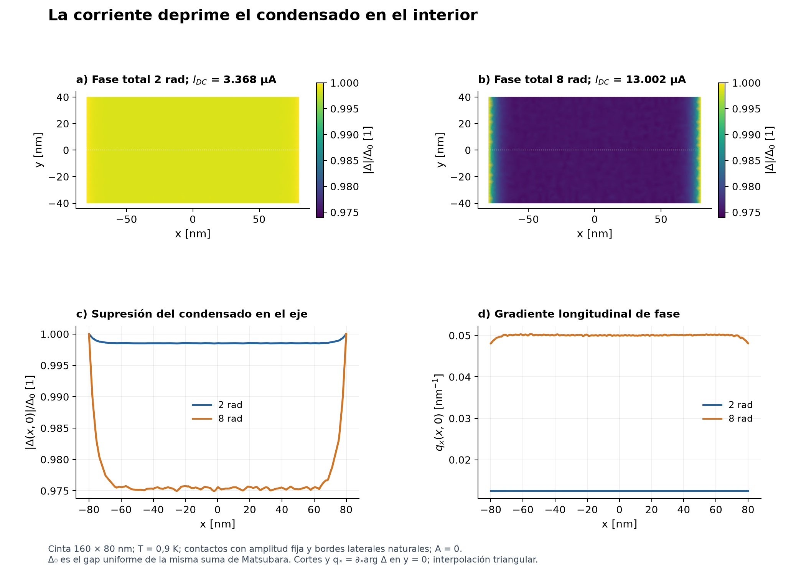
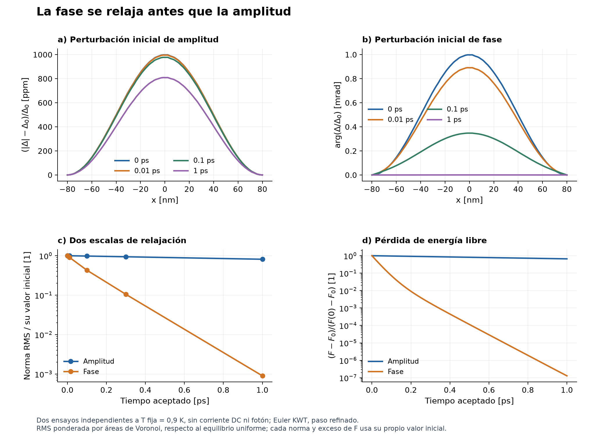
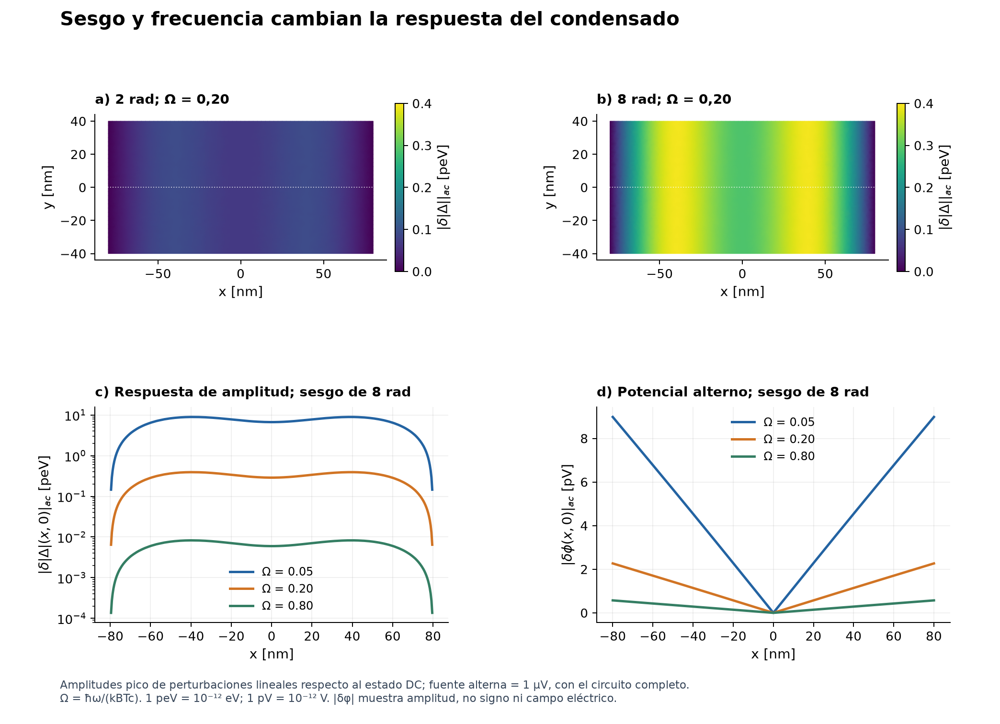
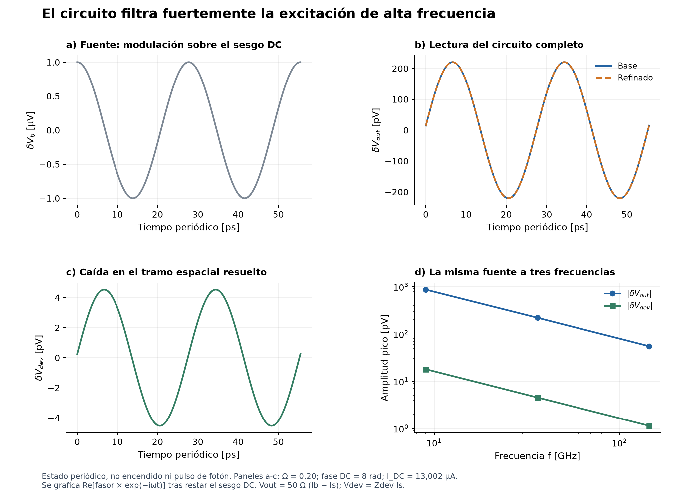
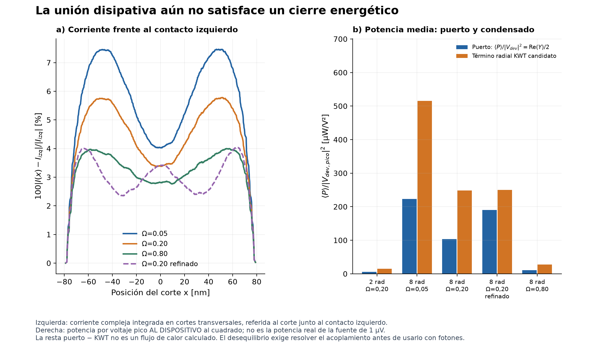

# Etapa 4: cierre de desarrollo y resultados físicos

24 de septiembre de 2026. Sin fotón. Producción y v1.0.0 sin cambios.

## La corriente debilita el condensado

<b>Cierre de desarrollo sin fotón.</b> Las dos referencias y las cinco respuestas terminaron en 48,57 min de cómputo total de campaña. Se obtiene una respuesta principalmente inductiva; el calentamiento absoluto todavía no queda admitido.

Figura 1. Campos estacionarios en la cinta 160 x 80 nm, 1712 nodos, 256 frecuencias Matsubara. Δ₀ es el gap uniforme sin corriente a la misma temperatura y corte. Mapas con escala común; perfiles interpolados en y=0. qₓ es el gradiente de fase, A=0. No se sustrae una solución del modelo anterior.

Al aumentar la corriente de <b>3,368 a 13,002 µA</b>, el mínimo de |Δ|/Δ₀ baja de <b>0,99849 a 0,97471</b>. La corriente exige un gradiente de fase y reduce la amplitud de equilibrio. Los contactos fijan su amplitud; por eso la depresión se concentra en el interior. La cinta sigue superconductora: esta banda de menor gap no es un hotbelt normal.

La tendencia conecta con el estudio de estados con corriente de Allmaras (2020, figs. 3.8-3.9). No se ha calculado aquí una corriente crítica ni una mejora porcentual frente a la memoria. Dos referencias estacionarias no determinan el umbral de detección.

Escenario de control: T=0,9 K, Tc=8,65 K, D=0,5 cm²/s y R□=608 Ω. Son escalas de referencia ajustadas; no mediciones independientes. La movilidad KWT usa los tiempos heredados 0,5/2,47 ps, no la pareja Korzh 6/24,7 ps.

## La fase se acomoda antes que el gap

El transiente térmico previo permite ver qué hace el solver en tiempo real: una pequeña perturbación de fase desaparece mucho antes que un exceso de amplitud.

Figura 2. Dos controles independientes sin corriente DC, T fija=0,9 K, hasta 1 ps. Perfiles centrales de exceso de amplitud y fase relativa. La norma RMS usa áreas de Voronoi; cada señal y exceso de energía libre se divide por su propio valor inicial. Son estados de pasos aceptados, no una reconstrucción armónica.

A 1 ps permanece el <b>81,29 %</b> de la norma inicial de la perturbación radial, mientras la perturbación compleja del ensayo de fase conserva sólo el <b>0,0898 %</b>. El reajuste eléctrico de fase puede ser rápido sin que la amplitud haya recuperado el equilibrio. Esto no autoriza a eliminar las distribuciones electrón-hueco de un evento de pocos picosegundos.

Las dos energías libres excedentes decrecen. Es relajación hacia un baño fijado, no calentamiento resuelto de electrones y fonones. El cálculo utiliza la malla dual y el Euler KWT de la memoria: la solución cuadrática de amplitud no lo convierte en segundo orden temporal.

Ensayo ya ejecutado: 1 ps en 153,81 s. Contraste temporal máximo: 0,2115 % de la señal inicial correspondiente. Defecto integrado de disipación de fase: 1,147 %; al dividir el paso, 0,577 %. No se repitió esta trayectoria para fabricar el informe.

## El gap responde menos al forzamiento rápido

La nueva campaña perturba periódicamente el estado con corriente. La amplitud, la fase y el potencial se obtienen del acoplamiento espectral y cinético, conservando ambas distribuciones.

Figura 3. Amplitudes pico de respuesta armónica sobre 3,368 y 13,002 µA (mapas); los perfiles corresponden a 13,002 µA. La excitación es δVb=1 µV en la fuente del circuito, no en el nanohilo. δVdev se calcula con la impedancia del dispositivo y δIs. Los campos son incrementos sobre la referencia DC; 1 peV=10⁻¹² eV y 1 pV=10⁻¹² V. Las curvas no representan un fotón.

Las frecuencias 9,01, 36,05 y 144,19 GHz corresponden a periodos de <b>110,97, 27,74 y 6,94 ps</b>. Las escalas 1/ω son 17,66, 4,42 y 1,10 ps; no deben confundirse con esos periodos. Al aumentar la frecuencia disminuye tanto la tensión que llega a la cinta como su respuesta de amplitud.

La caída de la perturbación del gap mezcla dos efectos: la respuesta propia del condensado y el filtrado del circuito. Por ello estas curvas, obtenidas a igual tensión de fuente, no miden por sí solas un tiempo intrínseco de relajación ni una latencia de detección.

Espectros y distribuciones: todos los nodos. Gap y potencial: Galerkin con 6 modos; contraste central con 10 modos, cuadratura y regulador refinados. La sensibilidad de la norma de amplitud al refinar es 0,644 %, con referencia refinada como denominador.

## El circuito conserva sus escalas lentas

La corriente debilita la rigidez del condensado y aumenta su inductancia. La fuente, el detector y la lectura se conectan mediante los tres estados circuitales de la memoria.

Figura 4. Respuesta periódica estacionaria, convención exp(-iωt), nunca transiente desde reposo. Incrementos AC respecto al punto DC. Las trazas se reconstruyen a partir de amplitudes complejas; no son pasos temporales integrados. Vout=RL(δIb-δIs). Base y refinado usan trazos continuo y discontinuo; su cambio se cuantifica en el texto.

La inductancia diferencial de la región resuelta pasa de <b>0,1952 a 0,2077 nH</b> entre ambas polarizaciones; el refinado da <b>0,2124 nH</b>. Se descuenta una sola vez de los 10 nH totales de referencia. El resto del dispositivo sigue presente como inductancia exterior.

Para 36,05 GHz, la fuente de 1 µV produce sólo <b>4,60 pV</b> en la región simulada y <b>0,2205 nV</b> en Vout. La pequeña señal refleja el filtrado de Lb=1 µH; no un pulso de detección. Vout cambia sólo 0,0005825 % al refinar, en parte porque dominan los componentes externos. No basta ese dato para validar la física interna.

Componentes sin acelerar: Rb=10 kΩ, Lb=1 µH, RL=50 Ω, C=100 pF y Ltotal=10 nH. La inductancia resuelta cambia 2,220 % respecto al refinado, pero sólo 0,04715 % de Ltotal: no bloquea el resultado circuital dentro de este alcance.

## La frontera está en corriente y calor

La buena estabilidad de los observables reactivos permite cerrar el desarrollo. El balance disipativo necesita una unión física adicional antes de interpretar un transiente fotónico.

Figura 5. Izquierda: variación de la corriente AC compleja integrada en cortes respecto al puerto izquierdo, dividida por su magnitud. Derecha: potencia media de puerto Re(Y)|Vdev|²/2 y calor radial KWT candidato, ambos por |Vdev|². Su diferencia no es un flujo de reservorio calculado independientemente.

En el refinado, el calor radial candidato es <b>249,82 µW/V²</b> y la potencia de puerto <b>190,16 µW/V²</b>: exceso del <b>31,37 %</b> respecto al puerto. El factor de amplitud pico y promedio temporal fue revisado. No se divide el calor por dos ni se relaja una tolerancia para hacer coincidir estas cantidades.

Re(Y) cambia <b>45,66 %</b> respecto a su valor refinado, mientras la admitancia compleja cambia sólo <b>1,589 %</b>. Es una diferencia pequeña para la respuesta mayormente inductiva, pero grande para el calentamiento. La corriente de los dos terminales casi coincide; el perfil interior muestra por qué eso no acredita continuidad local.

En 1477 cortes exhaustivos, la desviación máxima interior respecto al puerto izquierdo es <b>4,045 %</b> en el refinado y <b>7,465 %</b> en el caso lento. No se declara una precisión local del 2 % a partir del residuo de la matriz reducida.

El lote no calcula un balance independiente de energía interna de segundo orden, trabajo DC y reservorios, ni evoluciona el calor B.41. No se ha demostrado una violación de la energía total del sistema completo; sí que esta entrega no certifica la disipación absoluta. Los residuos fuera de la base espacial deben resolverse antes de promoverla.

## Cierre y entrada a la etapa final

<b>Etapa 4 cerrada como desarrollo con límites.</b> Se conserva la evidencia admitida y se prepara la etapa 5. El contrato general no térmico permanece incompleto y el modelo actualizado no se activa en producción.

El lote ejecutó 2 referencias, 5 respuestas y 6688 consultas energéticas de respuesta en 48,57 min (11,39 min de referencias y 37,18 min de respuestas). Compartió hasta 28 de 32 hilos, reservando dos núcleos físicos y limitando BLAS por proceso. La regresión de cierre pasó 43 pruebas en 1,588 s.

| Capacidad | Decisión de cierre |
| --- | --- |
| Núcleo térmico y paso Euler dual | Admitidos en los estados y sondas probados. No repetir estos controles. |
| Respuesta reactiva y circuito | Admisión condicionada del régimen débil. No extrapolar al umbral fotónico. |
| Disipación y continuidad local | No admitidas como cierre general: completar trabajo, calor y campos fuera de la base. |
| Fotón, hotbelt y latencia | No ensayados. Transferencia, ancho y tasas absolutas NbN siguen abiertos. |

<b>Siguiente trabajo concreto:</b> reutilizar los operadores dispersos existentes para comprobar corriente interior; completar el balance independiente de trabajo/calor; unir las poblaciones, gap, potencial y circuito en un transiente débil con Euler. Después se fijan preparación fotónica, material, dominio y gatillo de Vout. No se programa otra corrida larga sin un piloto de coste y una decisión que vaya a resolver.

<b>Repositorio:</b> se retiran 19 PDF intermedios y 15 trayectorias duplicadas exactas (122,54 MiB). Se conservan cierres, copias canónicas y fuentes; un manifiesto SHA256 y un restaurador recuperan los históricos. Los nuevos datos de revisión ocupan unos 3 MB; las salidas originales y los campos Matsubara completos permanecen en scratch de Geminga. No se reescribe Git ni el tag v1.0.0.

<b>Fuentes y trazabilidad:</b> resultados de la campaña stage4_final_coupling_20260924, commit ejecutado c80c0f8; controles dual_kwt de etapa 4. Allmaras (2020), figs. 3.8-3.9, para el contexto de corriente y gap: <link href="https://thesis.caltech.edu/13748/08/Allmaras_Thesis_Final.pdf" color="#135b70">tesis original</link>. Circuito: adenda circuito_memoria_20260922. Las figuras son cálculos propios, no reproducciones de curvas experimentales.

Índice vigente: docs/implementation/stage4/closure_20260924/README.md. Próximo contrato: docs/implementation/stage5/README.md. Alcance formal: closure_decision.json; valores y normas: physics_review.json; hashes: data_manifest.json.
