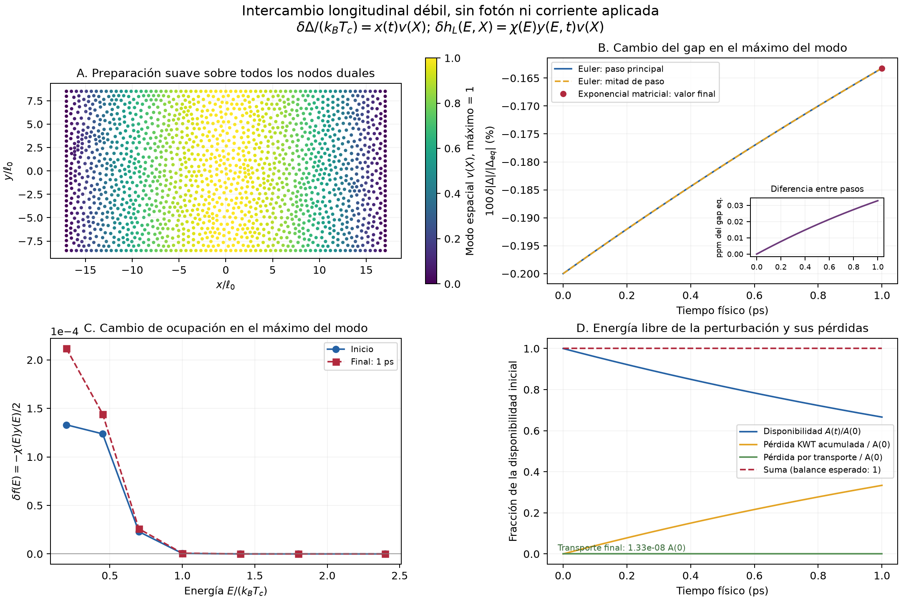
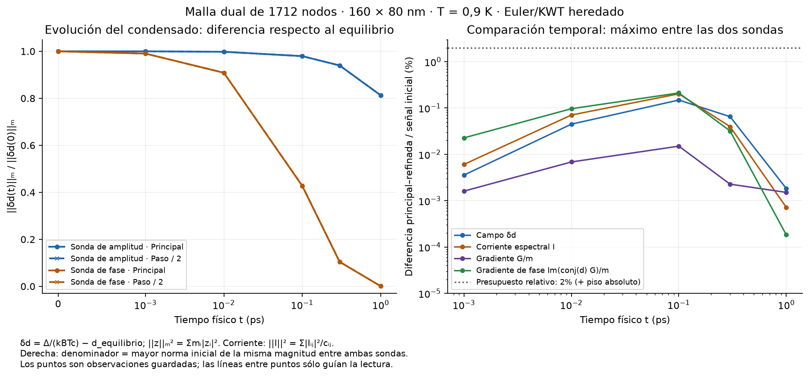
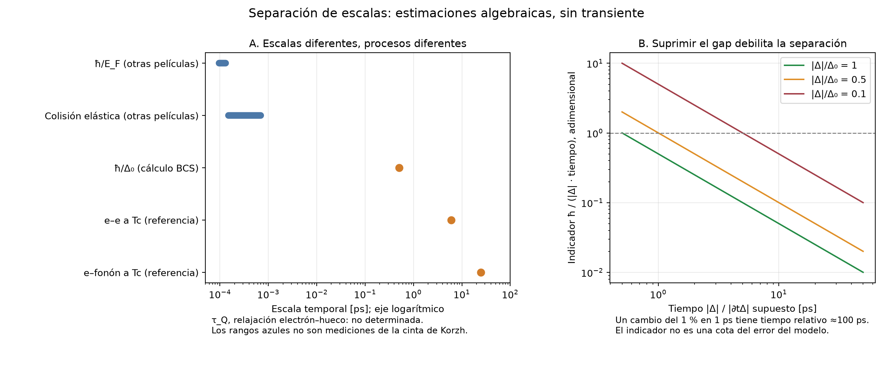

# Etapa 4: resultados Euler KWT y separación de escalas

La [política revisada](acceptance_policy.json) acepta las 96 comparaciones del
transiente térmico anterior, incluidas las 24 con pasos diferentes, con un
margen del 2 % de la escala inicial del mismo observable. El desacuerdo máximo
era 1,500017 %. No queda pendiente repetir esa cola. Se conservan los datos y
el veredicto bajo la tolerancia original.

Se prueba directamente el paso `TDGLSolver.solve_for_psi_squared`, mediante el
puente ya comprobado: su cuadrática local para el módulo es parte de un avance
Euler de **primer orden temporal**. La [nota de método](method_and_tolerances.md)
explica la distinción y los criterios aplicados a la campaña.

## Resultado ligero ya obtenido

El [control longitudinal](longitudinal/README.md) evoluciona hasta 1 ps una
perturbación débil del condensado y de poblaciones con forma energética no
térmica. Usa un sector invariante exacto del modelo linealizado en la malla
dual de 1712 nodos; se contrasta contra los operadores espaciales existentes.

- Error temporal respecto a la referencia matricial: **0,003288 %** de la
  norma inicial de disponibilidad.
- Defecto del balance integrado: **0,006619 %** de la disponibilidad inicial.
- Ocupaciones dentro de su soporte y convergencia de Euler de primer orden.
- Duración del cálculo en Geminga: **0,078 s**, un CPU.

Cada panel identifica su magnitud y normalización. La disponibilidad es energía
libre cuadrática de la perturbación; no es energía interna total ni calor
depositado en fonones. Las siete energías son una cuadratura de diagnóstico,
no una determinación convergida de tasas NbN o de su tiempo cinético material.

## Campaña KWT completada sobre la malla final

La campaña completa terminó en **153,81 s** y alcanzó **1 ps**. Pasaron las
40 comparaciones a tiempo positivo; la mayor diferencia entre pasos es
**0,21155 %** de la señal inicial del observable. El defecto máximo del balance
es **1,14673 %**, que baja a **0,57708 %** con medio paso. No hubo aumentos de
energía libre. Las **893440 predicciones** satisficieron el residuo no lineal
completo, con máximo **3,96×10⁻⁸**, sin correcciones Newton adicionales.

El [análisis reproducible](thermal/analysis.md) define las normas y enlaza
las tres figuras: evolución y refinamiento, balance integrado y mapas.
El [informe PDF](https://github.com/JoaquinDiazM/pysnspd/blob/c80c0f8612d8fd5a2b390938ca5ed4b9d58d3caa/output/pdf/implementation/Informe_etapa_4_Euler_y_acoplamiento.pdf)
reúne los resultados con magnitudes y denominadores explícitos.

El ensayo usa el mismo cierre de 256 frecuencias, T=0,9 K, Tc=8,65 K y tiempos
KWT de la memoria. La cinta de 80×160 nm es la geometría provisional ya
preparada. Los contactos de los extremos mantienen el gap uniforme y el
potencial normal cero; las paredes laterales son aislantes. No hay fotón,
fuente eléctrica aplicada ni cambio de constantes circuitales para acelerar
el cálculo. Este ensayo no conecta todavía el circuito.

La referencia uniforme satisface exactamente la ecuación de gap de esa suma
finita y no necesita resolver un problema espacial por frecuencia. Dos sondas
suaves, una de amplitud y otra de fase, sí evolucionan todos los nodos libres
y resuelven el espectro espacial no lineal. Cada sonda se integra con un paso
y medio paso. El límite inicial de estabilidad es 0,001729814 ps para el paso
primario; la partición se ajusta a los instantes guardados sin pasos finales
microscópicos de redondeo.

La precisión se mide sobre cambio complejo del gap, corriente, fuerza y fuerza
de fase. El presupuesto es 2 % de la mayor señal inicial del **mismo observable**
entre las dos sondas, más el piso absoluto declarado. Así una respuesta cruzada
inicialmente nula no impone una precisión relativa imposible. El balance usa
la pérdida de energía libre más la integral de disipación KWT y Joule normal,
comparada con el 2 % de la energía inicial de cada sonda. También se registra
el máximo defecto durante la historia, no sólo el valor final.

El piloto inicial terminó en 29,57 s y llegó a 0,001 ps. No mostró crecimiento
de energía. Su coste estimado motivó reutilizar las factorizaciones espectrales
del estado uniforme, igual que en la implementación temporal anterior. Un
predictor sólo se admite tras evaluar el residuo **no lineal completo** con
la misma tolerancia 10⁻⁷; si no la satisface, se usa Newton existente. Esto
reduce trabajo algebraico sin congelar el espectro ni sustituir la fuerza.

El [cuaderno de comandos](../../../GEMINGA_COMMANDS.md) contiene la ejecución
vigente y su coste medido. La campaña imprime avance y ETA, respeta el 90 %
del presupuesto detectado, limita BLAS/OpenMP a un hilo por proceso y guarda
estados aceptados. Los checkpoints permiten una recuperación explícita; no
se promete un reinicio automático que el ejecutable no ofrece.

## Condición real de cierre

La [nota de alcance](longitudinal_scope.md) identifica lo que acreditan los
controles separados y lo que falta del contrato acoplado. Esta campaña admite
el avance KWT en la malla dual. No se declara concluida toda la etapa 4: todavía debe acreditarse la unión dinámica general
entre trabajo espectral, poblaciones, fase, potencial, disipación y puertos.
Los términos físicos ausentes no son tolerancias numéricas que puedan relajarse.
La producción y el tag v1.0.0 permanecen intactos.

## Investigación solicitada: ¿qué puede considerarse inmediato?

La [evaluación cuasiclásica](quasiclassical_assessment.md) distingue las
colisiones elásticas de femtosegundos, la escala superconductora de referencia
ħ/Δ₀≈0,50 ps y los tiempos de redistribución de las poblaciones. Un cambio
del gap de 1 % en 1 ps es adiabáticamente mucho más favorable que un cambio
de orden unidad en el mismo tiempo. No se usa el jitter como tiempo local
de evolución ni se identifica neutralidad con equilibrio electrón–hueco.

Recomendación: mantener Usadel difusivo, conservar las distribuciones dinámicas
y evaluar la aproximación espectral adiabática por separado. No hace falta
iniciar ahora un solver completo de dos tiempos; tampoco sería correcto
declarar instantánea toda la física microscópica. Los cálculos de escalas son
algebraicos y no cambiaron las ecuaciones ni los parámetros de las corridas.

