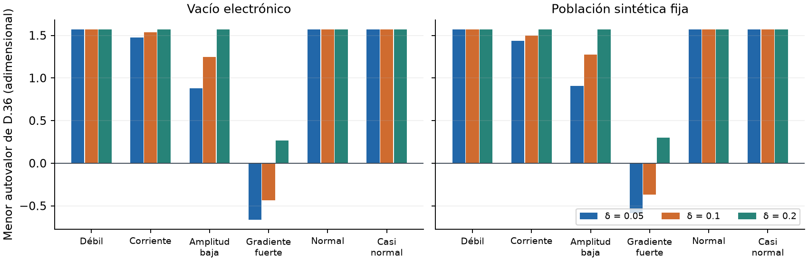
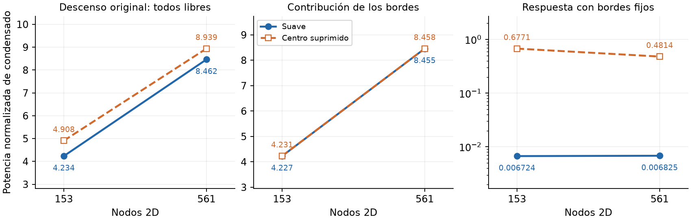
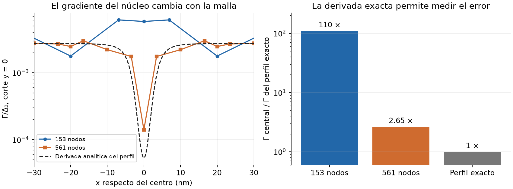
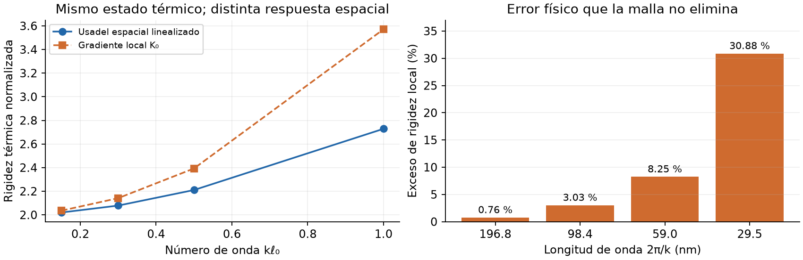

# Etapa 4A: resultados y continuación enfocada

23 de septiembre de 2026. **46 controles completados; etapa 4 aún abierta.**
[PDF ilustrado](../../../../output/pdf/implementation/Informe_avance_etapa_4A.pdf).

Los 40 controles locales demoraron 27,23 s y los seis estados 2D, 31,30 min.
Se verificaron el plan, las 11 fuentes de cada lote y los 52 archivos de
resultados/mapas. Son campos prescritos y respuestas instantáneas, no transientes.
Material: Tc=8,65 K, baño 0,9 K, D=0,5 cm²/s, R□=608 Ω, película de 7 nm y
ancho de 80 nm. Es el escenario de modelo Korzh admitido provisionalmente;
estos parámetros no se convierten aquí en mediciones.

## Resultados que orientan la siguiente corrida

| Resultado | Evidencia | Decisión |
|---|---|---|
| Energía, fuerza y corriente coherentes en los controles | Error de derivada espacial ≤2,37e-9; balance KWT ≤8,89e-16 | No repetir la batería completa |
| Resolución espectral suficiente para estos controles | Cambio relativo de fuerza ≤3,13e-8 en las anclas | Mantener resolución espectral |
| 36 controles locales positivos; cuatro negativos | Negativos sólo en gradiente fuerte, δ=0,05/0,1, ambas poblaciones | Mantener exclusiones constitutivas |
| Calor total suave aparentemente duplicado | 4,234→8,462; 99,92 % en el borde fino | Separar reacciones y restringir el borde |
| Interior suave poco sensible a malla | Calor +1,50 %; fuerza volumétrica +0,051 % | Reutilizar evidencia |
| Núcleo todavía poco resuelto | Calor interior -28,91 %; fuerza -7,98 % | Una malla más fina, misma física |
| Negativo espacial grueso no confirmado en continuo | Γ central ≈110 veces el analítico; D.36 analítico positivo | No aumentar δ para ocultar error |

D.36 describe la rigidez de las variaciones espaciales cortas. Su menor autovalor
negativo limita el dominio de estados que se puede evolucionar. Los controles
locales negativos son distintos del único punto espacial grueso: los primeros
tienen gradientes prescritos directamente; el segundo contiene una derivada
aproximada de un perfil estrecho. δ regulariza la descripción de fase cerca de
amplitud cero. No se ha calibrado como parámetro del dispositivo.

## Bordes y disipación

El descenso original actuaba también sobre nodos exteriores de un campo impuesto.
Esa reacción, dividida por una masa nodal cada vez menor, produjo la duplicación.
Se reconstruyeron los seis estados con carga conjugada igual al gradiente integrado
en los cuatro bordes. Su velocidad y trabajo son cero; el balance conserva todos
sus términos y el interior queda igual. Se necesitaron **cero consultas espectrales**.

Esta condición compara un campo prescrito; no representa bordes aislantes ni
reservorios del dispositivo. Las potencias usan la misma normalización entre
mallas. La nueva norma de fuerza divide el gradiente integrado por la masa y
pondera por volumen. La corriente máxima por arista se conserva como dato
histórico; la próxima salida suma el flujo por sección.

## Gradiente del centro y dos estados nuevos

El núcleo prescrito tiene amplitud mínima 0,04. Con δ=0,05, su único D.36 negativo
en 153 nodos vale -0,785; con la derivada exacta del mismo perfil vale +1,571, igual
que para δ=0,1 y 0,2. Es un candidato a artefacto de resolución; todavía no se
certifica el signo de todo el campo continuo. Con δ=0,1, Γ central/exacto pasa
de 109,8 a 2,65 entre 153 y 561 nodos.

El [plan siguiente](next_campaign_plan.json) tiene sólo:

1. δ=0,05, 8×4 elementos de grado 4, 561 nodos: revisar el signo con mejor derivada.
2. δ=0,1, 16×8 elementos de grado 4, 2145 nodos: comprobar resolución del núcleo
   y sensibilidad de la disipación interior.

Se reutilizan población, perfil y catálogo. Se incorporan bordes fijos, derivadas
exactas/discretas, corriente por sección y las tres movilidades sobre los mismos
espectros. No se repiten diferencias finitas globales ni anclas espectrales. Coste
estimado: 40-65 min, un hilo, 1-2 GiB RAM; ejecución manual.

## Límite físico independiente

Se recalculó C.29-C.31 a Tc=8,65 K y T=0,9 K, con corriente nula y gap BCS
autoconsistente. ℓ₀=4,69849 nm. El exceso de rigidez local es 0,763 %, 3,027 %,
8,254 % y 30,881 % para longitudes de onda de 196,81, 98,40, 59,04 y 29,52 nm.
Este sesgo físico persiste al refinar la malla. Con idéntica movilidad, el último
tiempo de relajación sería un 23,6 % menor: t_local/t_Usadel=0,7641. No demuestra
un error de latencia del detector.

La referencia mantiene temperatura impuesta; no es la Hessiana de una población
no térmica congelada. Las sumas con cola analítica verifican estabilidad numérica,
no incertidumbre física. Véase [referencia y restricciones](linear_usadel_reference.md).

## Núcleo numérico y alcance

Producción mantiene Delaunay-Voronoi adaptado de pyTDGL y Euler adaptativo de
primer orden, con resolución implícita local de amplitud. El circuito usa RK2 de
punto medio; el acoplamiento completo no adquiere por ello segundo orden. Los
ensayos 4A usan elementos nodales Gauss-Lobatto-Legendre en un rectángulo 2D.
No han sustituido producción ni elegido un integrador definitivo. Véase
[procedencia](solver_scope.md) y [documentación oficial de pyTDGL](https://py-tdgl.readthedocs.io/en/latest/background.html#implicit-euler-method).

Siguen pendientes referencia de núcleo físico y evolución débil con bordes/circuito
compatibles y sus dependencias de etapa 3. Las consultas espectrales dominan el
coste; antes de transientes extensos se preparará reutilización o interpolación
consistente de energía y derivadas. El circuito futuro sigue siendo el de la
memoria. No se admite fotón, transferencia, hotbelt, jitter ni latencia óptica.

## Evidencia y reproducción

- [Auditoría independiente](independent_audit.json) y [resumen](independent_audit.md).
- [Restricciones de borde y balances](boundary_response_review.json).
- [Referencia Usadel nueva](linear_usadel_reference.json).
- [Estado](review_status.json) y [comandos](../../../GEMINGA_COMMANDS.md).
- `raw/` conserva resultados originales; `previous_delivery_exact/` conserva
  las fuentes sustituidas. Las entregas históricas permanecen verificables.
