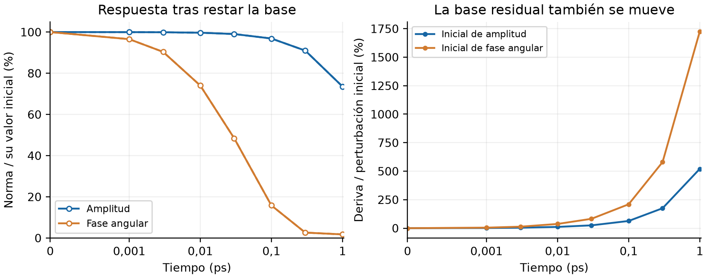
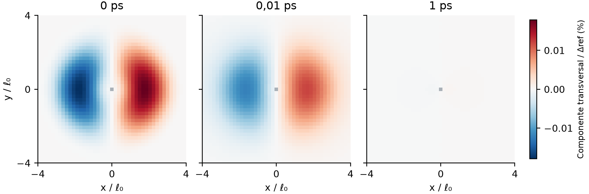
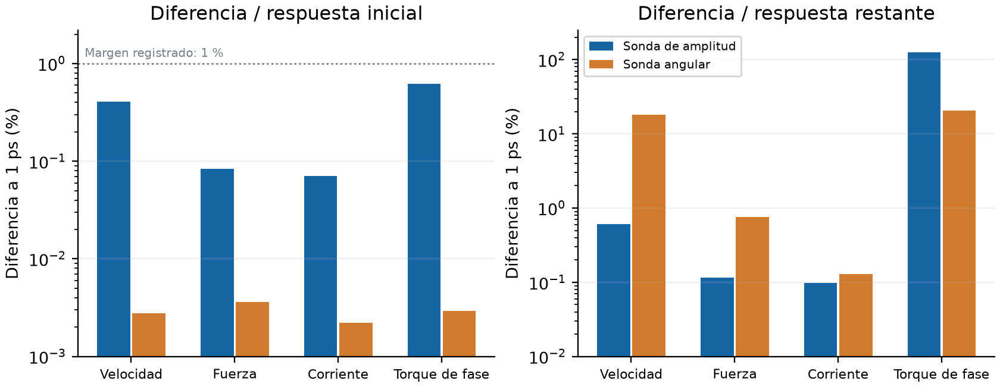

# Etapa 4: evolución térmica y contraste no lineal

El ensayo térmico débil completó **1 ps en 71,10 s**. Pasaron el refinamiento
temporal registrado y el contraste posterior de sus estados con la respuesta
espectral no lineal. Esto permite continuar con la integración térmica no lineal;
la etapa 4 permanece abierta y todavía no se acredita el dispositivo con fotón.

El [informe ilustrado en PDF](../../../../output/pdf/implementation/Informe_etapa_4_evolucion_termica.pdf)
presenta cuatro páginas con las curvas, mapas, diferencias y límites de precisión.

## Qué evolucionó

Se conservaron todos los nodos libres, los parámetros y los contactos. El trabajo
se repartió entre 27 trabajadores y un coordinador, reservando dos núcleos
físicos. El avance reutilizó 256 factorizaciones y aplicó el operador en 246 lotes.

Al restar la relajación de la base, queda a 1 ps el **73,59 %** de la perturbación
inicial de amplitud y el **1,751 %** de la perturbación angular. Cada porcentaje
usa la norma inicial de su propia sonda. La base residual también se desplaza:
al final su norma equivale a 5,20 veces la sonda inicial de amplitud y 17,25 veces
la angular. Por eso mirar sólo el mapa total ocultaría la respuesta buscada.

El desplazamiento máximo total fue **0,2217 %** del gap de referencia, dentro
del corte de trabajo lineal del 2 %. Ese corte no es un rango experimental del
material. Se verificaron 37 checkpoints y 257 insumos del operador.

## Qué precisión tiene la cola

Las diferencias máximas del refinamiento angular fueron 0,0383 % para el
desplazamiento y 0,1155 % para el torque, respecto a las señales iniciales. El
criterio registrado usaba 0,5 % de la mayor norma entre inicial y restante, más
una tolerancia absoluta.

A 1 ps sólo queda el 0,0163 % del torque angular inicial. La diferencia entre
corridas puede alcanzar el 160 % de ese pequeño resto. La aceptación respecto
a la escala inicial no equivale a esa misma precisión relativa en la cola; no
se obtiene de ella un tiempo de relajación preciso.

Los mapas muestran la componente perpendicular al condensado inicial en su
plano complejo, después de restar la base. Mantienen la misma escala. El punto
gris central deja explícito que la dirección de fase no se define donde el
condensado se anula.

## Energía y respuesta no lineal

La energía cuadrática disminuyó y la disipación KWT más normal fue positiva.
El mayor desajuste instantáneo de tasa más disipación alcanzó el **0,07692 %**
de la disipación. El defecto de la ley de velocidad aproximada llegó al
**0,2316 %** de la velocidad total. Son diagnósticos de Taylor, distintos de un
balance temporal no lineal exacto.

El contraste posterior resolvió **2.048 problemas espectrales en 22,74 s**,
evaluando nueve estados guardados a 0, 0,01 y 1 ps y reutilizando la base inicial.
Todas las respuestas del núcleo cumplieron el margen registrado del 1 %,
referido a la mayor escala entre inicial y restante. Cada sonda se comparó
restando la base exacta del mismo instante.

| Diferencia de velocidad a 1 ps | Respecto a la inicial | Respecto al resto |
|---|---:|---:|
| Sonda de amplitud | 0,4056 % | 0,6107 % |
| Sonda angular | 0,002785 % | 18,04 % |

Se resolvió además una dificultad numérica de Newton: restar energías próximas
a -62,296 cambiaba el signo aparente de un descenso de unas pocas unidades de
10⁻¹⁵. La diferencia estable evalúa la misma acción y conserva tanto la prueba
de descenso como la tolerancia. El fallo original queda documentado. Una nueva
aplicación del avance afín evita asimismo la coordenada auxiliar que había
derivado el 0,00221 %; los resultados originales se conservan.

## Siguiente avance

La siguiente prueba integrará el mismo sistema térmico no lineal con corrección
de segundo orden. El operador preparado agiliza la parte lineal y la fuerza
espectral se recalcula para el condensado que evoluciona. Evaluar los estados
guardados todavía no equivale a ejecutar esa trayectoria no lineal de 1 ps.

Siguen pendientes la evolución acoplada y el trabajo espectral no térmico.
Producción, el circuito completo y el tag v1.0.0 permanecen intactos. Etapa 5
no se activa con este ensayo.

Los datos, normas y certificados están en [analysis.json](analysis.json),
[raw/extraction_receipt.json](raw/extraction_receipt.json) y
[nonlinear_snapshots/summary.json](nonlinear_snapshots/summary.json).
