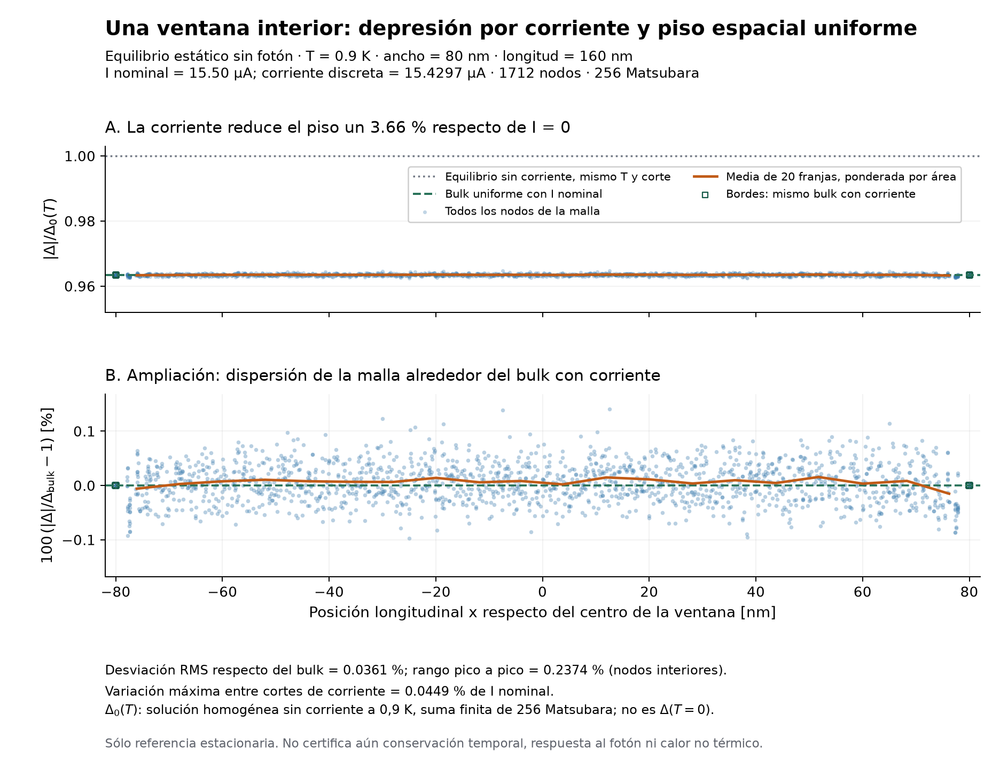

# Preparación de una ventana interior antes del fotón

La campaña larga está **preparada, pendiente de ejecución**. El objetivo es
conservar un piso espacial con corriente DC en la malla dual, conectado al
circuito completo de la memoria. Los cortes numéricos continúan el mismo
superconductor con corriente. No representan contactos metálicos.

El [contrato físico y las fuentes](physical_scope.md) explican la geometría de
Korzh y la partición inductiva. El [plan ejecutable](campaign.json) fija entradas,
criterios y versiones de código. La implementación de producción permanece
intacta; este ensayo usa los módulos experimentales.

## Resultado ligero disponible



El [piloto estático](pilot/receipt.json), sobre 1712 nodos y 256 frecuencias de
Matsubara, convergió en 108 s. A 15,5 µA nominales, la corriente discreta es
15,4297 µA. La corriente reduce el gap homogéneo un 3,659 % respecto del equilibrio
sin corriente a la misma temperatura. En torno a ese piso, la dispersión RMS
ponderada por área es 0,0361 % y el rango pico a pico es 0,2374 %; se incluyen
todos los nodos interiores, sin recortar zonas que oculten efectos de borde.
La variación máxima de la corriente en los 1477 cortes longitudinales es
0,0449 % de la corriente nominal. Esto acredita esta referencia estacionaria,
no los diez picosegundos del ensayo pendiente.

El piloto temporal posterior completó **50 pasos en 7,26 s**, a dt = 0,0001 ps.
La deriva máxima del gap fue 7,64×10⁻¹⁰ de su piso inicial; Vout llegó a
11,69 pV. Vdev fue del orden de 4,8 µV: es una relajación numérica inicial
visible y no se oculta tras el filtrado del circuito. El horizonte de 0,005 ps
sólo valida la integración y su coste; no sustituye la conservación larga.
La [evidencia de rendimiento](pilot/temporal_pilot.json) registra también el
primer backend, detenido a 180 s por su coste. La reutilización de Jacobianos
conserva el residuo no lineal original y reproduce la trayectoria compartida:
diferencia máxima en Vdev de 7,6×10⁻¹⁵ V. No se relajaron tolerancias para
obtener esa aceleración.

## Qué se ejecutará

| Referencia | Corriente nominal | Ventana 2D | Resolución objetivo | Nodos |
|---|---:|---:|---:|---:|
| `dc155_l160_h5` | 15,5 µA | 160 × 80 nm | 5 nm | 1712 |
| `dc215_l160_h5` | 21,5 µA | 160 × 80 nm | 5 nm | 1712 |
| `dc215_l160_h35` | 21,5 µA | 160 × 80 nm | 3,5 nm | 3516 |
| `dc215_l320_h5` | 21,5 µA | 320 × 80 nm | 5 nm | 3659 |

Primero se relajan cuatro equilibrios independientes. Cada uno que cumpla sus
criterios habilita una trayectoria DC de **10 ps**. Una quinta trayectoria
repite `dc215_l160_h5` con la mitad del paso temporal. La ventana de 10 ps sirve
para observar la deriva del fondo oscuro; no define todavía el umbral ni el
horizonte de detección del futuro fotón. Los tamaños 2W y 4W comprueban la
preparación del bulk, no la suficiencia del dominio ante propagación fotónica.

Se conservan T = 0,9 K, Tc = 8,65 K, D = 0,5 cm²/s, R□ = 608 Ω y los tiempos
de referencia de Korzh τee(Tc) = 6 ps y τep(Tc) = 24,7 ps. Son el escenario
publicado de modelado seleccionado, no un conjunto íntegramente medido.
La rama homogénea creciente admite ambas corrientes; esa propiedad no demuestra
estabilidad frente a entrada de vórtices o defectos de un dispositivo real.

El circuito mantiene Rb = 10 kΩ, Lb = 1 µH, RL = 50 Ω y C = 100 pF. Para cada
equilibrio se fija una sola vez

$$L_{k,\mathrm{ext}}=96\,\mathrm{nH}
 +(5\,\mu\mathrm m-L_{\mathrm{res}})\,\mathcal L_{\mathrm{bulk}}(I_{\mathrm{DC}}).$$

La inductancia diferencial del bulk incluye la depresión estacionaria por
corriente. Su valor queda congelado durante la evolución: no hay Lk(t).
El segmento resuelto aporta su voltaje mediante sus propios campos; no se
añade por segunda vez como inductor circuital. Cambiar la longitud de ventana
redistribuye segmentos del mismo dispositivo y conserva su inductancia de
equilibrio total. Para 160 nm, Lext ≈ 103,109 nH a 15,5 µA y 105,772 nH a
21,5 µA. La diferencia entre corrientes corresponde a dos puntos DC distintos,
no a una actualización dinámica.

## Cómo avanza y qué admite

Los extremos eléctricos son equipotenciales. La corriente Is del circuito
alimenta esos puertos; su voltaje vuelve al circuito. Las fases terminales
obedecen Josephson, manteniendo la magnitud del gap y del espectro del bulk.
Los laterales mantienen condiciones naturales sin flujo. La fuente permanece
DC, inicializada con Vb = Rb × I de la referencia discreta; se registra su
diferencia con la corriente nominal. No se resta una fuerza de fondo para
fabricar estacionariedad.

El avance usa la **misma cuadrática KWT Euler heredada, de primer orden**,
evaluada mediante el incremento de amplitud para evitar cancelación numérica.
Las pruebas comprueban equivalencia algebraica, raíz y refinamiento temporal.
El paso primario es el menor entre 0,0001 ps y una cota conservadora del símbolo
lineal uniforme; el segundo ensayo lo divide por dos. Esa cota orienta el paso:
la admisión depende de los observables obtenidos, no de atribuirle validez
universal para un fondo polarizado.

| Comprobación | Margen y significado |
|---|---|
| Referencia: RMS y rango del gap respecto del bulk | ≤ 1 %; homogeneidad sobre todos los nodos libres |
| Corriente nominal y cortes interiores de la referencia | ≤ 2 % de la nominal |
| Deriva temporal y rango espacial de la magnitud del gap | ≤ 1 % del piso inicial |
| Corrientes de sección, de circuito y su deriva | ≤ 2 % de la corriente nominal |
| Lectura oscura | \|Vout\|/(RL \|Iref\|) ≤ 10⁻³; escala de señal, no umbral experimental |
| Balance isotérmico integrado | ≤ 1 % de U₀ΣᵢAᵢ\|Δᵢ(0)/(kBTc)\|² |
| Comparación de malla, longitud y paso | Gap ≤ 1 %, corriente ≤ 2 %; diferencia de lectura normalizada ≤ 10⁻³ |

U₀ = ħI₀/(2e), I₀ = kBTc/(2eR□), y Aᵢ es el área dual adimensional.
La escala energética de la tabla es una normalización declarada; no es una
diferencia Fnormal − Fsuper calculada. El balance incluye el trabajo de las
fases espectrales en los extremos. Estados no finitos, raíces inadmisibles o
salidas grandes del entorno DC detienen el caso sin recortar campos.

Los límites toleran un error de preparación pequeño frente a la supresión del
condensado y la señal de detección buscadas. No se exige error relativo respecto
de un voltaje oscuro exactamente nulo. La gráfica mostrará Vdev además de Vout:
el filtrado del circuito no debe ocultar una deriva interna.

## Ejecución y salidas

```bash
cd /home/jdiaz/pysnspd
/home/jdiaz/.conda/envs/snspd/bin/python -u sandbox/stage5_prephoton/run_prephoton_dc.py \
  --plan docs/implementation/stage5/prephoton_dc_20260924/campaign.json \
  --output-root /home/jdiaz/scratch/stage5_prephoton_dc_20260924 --execute
```

El comando corre en primer plano y necesita un destino nuevo. Detecta CPU,
afinidad, cuotas y RAM disponibles. Dos casos independientes comparten hasta
28 CPU lógicas en el inventario de 32; los trabajadores espectrales y los
coordinadores están incluidos. Se reservan dos núcleos completos y se limita
BLAS/OpenMP a un hilo por proceso. Imprime barras y ETA; conserva registros
detallados por caso. Una referencia no admitida bloquea sólo sus trayectorias.
No se sobrescriben ni reintentan casos automáticamente.

Se estiman **10–24 horas para el conjunto**, extrapoladas del piloto y del
tamaño de las mallas; la renovación de factores o la carga del servidor puede
cambiarlo. La ETA sustituye esta estimación con el avance observado. La
reutilización espectral almacena un Jacobiano por frecuencia, propone una
corrección y comprueba la ecuación no lineal exacta. Si no cumple la misma
tolerancia, ejecuta Newton y renueva el factor. Se guardan los contadores de
esas operaciones para evaluar el rendimiento real.

Al finalizar se generan `analysis.json`, `analysis.md` y las figuras físicas
en `figures/`. `workflow_result.json` distingue finalización de ejecución y
admisión física. Las referencias espectrales se guardan una vez por caso; las
trayectorias guardan aproximadamente 101 instantáneas y resúmenes, mientras
los máximos y balances se calculan en todos los pasos. Los datos completos
quedan en scratch, no en Git.

Revisión de entradas y recursos, sin simulación:

```bash
cd /home/jdiaz/pysnspd
/home/jdiaz/.conda/envs/snspd/bin/python sandbox/stage5_prephoton/run_prephoton_dc.py \
  --plan docs/implementation/stage5/prephoton_dc_20260924/campaign.json \
  --output-root /home/jdiaz/scratch/stage5_prephoton_dc_20260924
```

La comparación es DC, térmica e isotérmica. Las distribuciones iniciales son
las de equilibrio; no se elimina del modelo general la evolución electrónica,
fonónica ni el desequilibrio electrón-hueco. Este control no certifica el calor
no lineal ni la transferencia del fotón pendientes. La futura variación de
posición será transversal; el jitter geométrico longitudinal queda fuera del
alcance acordado.
