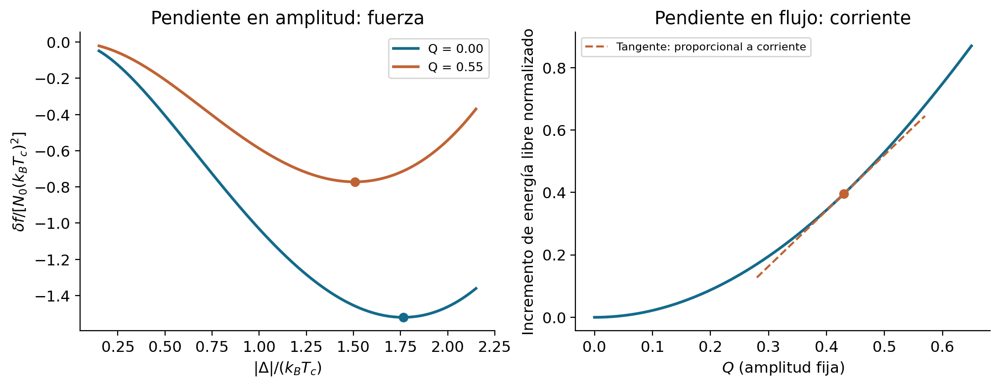
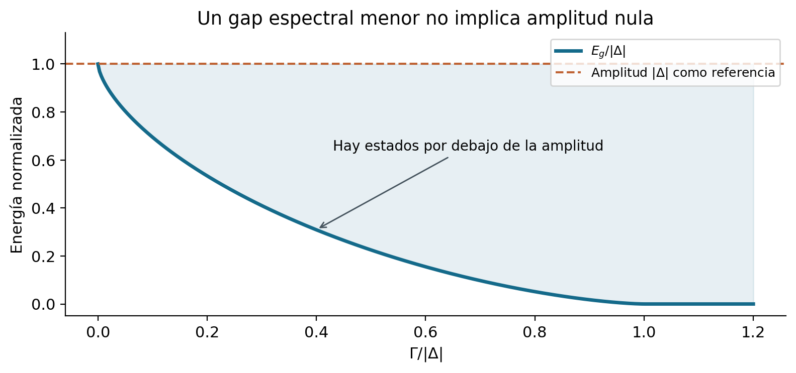
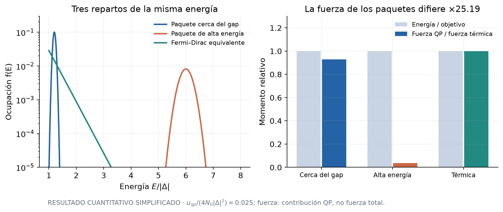

# A.0. Propósito de esta revisión

Se busca ampliar las capacidades de modelamiento de SNSPD: describir mejor cómo la corriente, el espectro electrónico y las excitaciones intercambian energía, conservando una implementación que pueda verificarse y utilizarse. La meta de esta etapa es un modelo microscópicamente informado y controlable, con mejoras medibles frente a la referencia de la memoria. No se exige reconstruir la dinámica completa del material desde primeros principios para avanzar.

**Corrección de la revisión 0.1.** Usar una corriente Usadel en una ecuación de orden GL modificada tiene una justificación explícita. Vodolazov introduce en el lado derecho de su ecuación (36), p. 11, una corrección proporcional a la diferencia de divergencias de las corrientes Usadel y GL. Su función es obtener la conservación de la corriente Usadel en el estado estacionario [V]. La memoria desarrolla esa cancelación en su anexo C.2, ecuaciones (C.4)–(C.10), pp. impresas 121–123 [M]. La combinación es un cierre aproximado motivado, cuya validez debe evaluarse mediante sus observables y su régimen de uso. No corresponde descalificarla porque sus partes provengan de distintas aproximaciones.

La pregunta nueva es más concreta: **¿podemos obtener la corriente y la fuerza sobre $|\Delta|$ a partir de una misma energía electrónica, para facilitar el balance durante la evolución?** Tener ese punto de partida proporciona identidades comprobables y evita contar dos veces el superflujo. Es una mejora de organización física; no es, por sí sola, una prueba de que toda predicción anterior sea incorrecta.

El recorrido del documento es: fijar convenciones (A.1), construir esa energía sin imponer todavía el equilibrio de $|\Delta|$ (A.2), identificar el espectro que sienten las excitaciones (A.3), proponer el acoplamiento no térmico adiabático (A.4), comparar cierres uniformes (A.5) y separar las limitaciones materiales de las matemáticas (A.6–A.7). Las hipótesis de la extensión no térmica se distinguen del funcional de equilibrio establecido.

# A.1. Convenciones y variables independientes

Se escribe $\Delta=|\Delta|e^{i\theta}$; $|\Delta|$ tiene unidades de energía y $e>0$. En unidades SI,

$$
\mathbf q=\nabla\theta-\frac{2e}{\hbar}\mathbf A,
\qquad \Gamma=\frac{\hbar D|\mathbf q|^2}{2},
\qquad \epsilon_n=\pi k_BT(2n+1).
\tag{A.1}
$$

$\mathbf q$ mide el gradiente de fase que impulsa el superflujo; $\Gamma$ es la escala de ruptura de pares asociada. La temperatura $T$, la amplitud $|\Delta|$ y $\mathbf q$ se mantienen independientes al construir el catálogo. Esto permite evaluar una fuerza restauradora cuando la amplitud aún no ha alcanzado el equilibrio.

$N_0$ es la densidad de estados normal **por espín**, volumen y energía, evaluada cerca del nivel de Fermi. Por tanto,

$$
\sigma_n=2e^2N_0D.
\tag{A.2}
$$

No se pueden elegir independientemente $N_0$, $D$ y $\sigma_n$. Para la formulación uniforme difusiva se usan $s_n=\sin\Theta_n$ y $c_n=\cos\Theta_n$, con

$$
|\Delta|c_n=(\epsilon_n+\Gamma c_n)s_n,
\qquad s_n^2+c_n^2=1,\qquad c_n\geq0\quad(n\geq0).
\tag{A.3}
$$

$\Theta_n$ parametriza el propagador espectral; no es la fase espacial $\theta$. La autoconsistencia de acoplamiento débil y la corriente uniforme son

$$
\begin{aligned}
G(T,|\Delta|,q)&=|\Delta|\ln\frac{T}{T_c}
+2\pi k_BT\sum_{n\geq0}\left(\frac{|\Delta|}{\epsilon_n}-s_n\right),\\
G(T,|\Delta|_{\rm eq},q)&=0,
\end{aligned}
\tag{A.4}
$$

$$
\mathbf j_s(T,|\Delta|,\mathbf q)
=\frac{2\pi\sigma_n k_BT}{e}\mathbf q\sum_{n\geq0}s_n^2.
\tag{A.5}
$$

A.3 se resuelve para cada amplitud ensayada. A.4 selecciona después la amplitud de equilibrio. **Resolver el espectro no obliga a imponer instantáneamente el equilibrio del condensado durante un evento.** Esta distinción es esencial para que $|\Delta|$ pueda seguir siendo una variable dinámica.

# A.2. Construcción y variación del funcional uniforme

## A.2.1. Qué energía buscamos y para qué sirve

El objetivo es construir una **densidad de energía libre electrónica** que contenga el costo del emparejamiento, las excitaciones electrónicas y el superflujo. Su derivada respecto de $|\Delta|$ dará la fuerza de amplitud; respecto de $\mathbf q$, la corriente; respecto de $T$, la entropía de equilibrio. El espectro y la DOS se obtienen del propagador estacionario de esa misma construcción.

No se trata únicamente de asignar una energía a las cuasipartículas. El fondo emparejado también cambia cuando cambian $|\Delta|$ o la corriente. Tampoco es la energía total del sólido: fonones, sustrato y campo electromagnético exterior se contabilizan por separado. La aproximación quasiclásica retiene los cambios electrónicos relevantes cerca del nivel de Fermi; no reconstruye cada nivel electrónico profundo ni toda la estructura de bandas.

La fuente [F] formula el potencial electrónico a potencial químico fijado. En la aproximación electrón–hueco simétrica y de DOS normal constante usada aquí, las diferencias superconductora–normal se pueden emplear como energía libre electrónica a densidad fijada, omitiendo constantes de referencia. Una descripción que retenga asimetría de bandas o redistribución apreciable de carga debe revisar esa identificación.

Una analogía útil es un paisaje cuya altura representa la energía. El espectro se acomoda rápidamente a cada punto $(|\Delta|,q)$ del paisaje; la amplitud puede permanecer fuera del mínimo y sentir su pendiente. La autoconsistencia selecciona puntos estacionarios; en una rama estable corresponden a mínimos locales en amplitud. La corriente corresponde a la pendiente en la dirección de superflujo.

{width=93%}

En esta figura $T=0.9$ K, $T_c=8.65$ K y $Q=q\sqrt{\hbar D/(2k_BT_c)}$ es el superflujo adimensional. Los puntos izquierdos son mínimos de energía a cada $Q$. A la derecha se fija $|\Delta|=1.4k_BT_c$ y la energía se divide por $N_0(k_BT_c)^2$: la tangente indica cómo se lee la corriente de una pendiente. Las fórmulas siguientes explican por qué ambas lecturas son compatibles.

## A.2.2. Desde la expresión de Virtanen, Vargunin y Silaev hasta A.6

El punto de partida preciso es la **ecuación (20), sección III, p. 094507-3 de [F]**, también ecuación (20), p. 3 del preprint arXiv v1. La especializamos a emparejamiento singlete $s$ isotrópico, sin campo de intercambio ni acoplamiento espín–órbita explícito, en el límite difusivo y de acoplamiento débil. Restaurando $k_B$ y $\hbar$, su estructura es

$$
\begin{aligned}
\frac{f_s}{N_0}
={}&\frac{|\Delta|^2}{V_{\rm pair}}\\
&-\frac{\pi k_BT}{2}\sum_{n\in\mathbb Z}
\operatorname{tr}_{N,s}\!\left[
\epsilon_n\tau_3\hat g_n+\hat\Delta\hat g_n
-\frac{\hbar D}{4}(\widetilde\nabla\hat g_n)^2
\right].
\end{aligned}
\tag{A.6a}
$$

Aquí $V_{\rm pair}$ es el acoplamiento atractivo adimensional de la regularización BCS; no es la función de Eliashberg ni el parámetro $\lambda$ de A.32. La traza abarca **Nambu y espín**, y la suma incluye frecuencias positivas y negativas. Se sobreentiende la regularización ultravioleta común de los términos de emparejamiento. La resta del estado normal se hará antes de retirar el corte.

Para ver los factores sin ocultarlos en notación matricial, elijamos una base Nambu de estados relacionados por inversión temporal. Tras quitar localmente la fase del gap mediante una transformación de calibre,

$$
\hat g_n=(c_n\tau_3+s_n\tau_1)\otimes\sigma_0,
\qquad \hat\Delta=|\Delta|\tau_1\otimes\sigma_0,
\qquad \hat g_n^2=1.
\tag{A.6b}
$$

Las matrices $\tau_i$ actúan en Nambu y $\sigma_0$ es la identidad de espín. En esta base, el singlete tiene estructura de espín trivial; en otra base puede aparecer una matriz $i\sigma_y$ sin modificar la traza física. Como $\operatorname{tr}_N\tau_i\tau_j=2\delta_{ij}$ y $\operatorname{tr}_s\sigma_0=2$,

$$
\operatorname{tr}_{N,s}(\epsilon_n\tau_3\hat g_n)=4\epsilon_nc_n,
\qquad
\operatorname{tr}_{N,s}(\hat\Delta\hat g_n)=4|\Delta|s_n.
\tag{A.6c}
$$

La uniformidad espectral significa $\nabla\Theta_n=0$, pero deja un gradiente de fase. En el calibre elegido,

$$
\widetilde\nabla\hat g_n
=\frac{i\mathbf q}{2}[\tau_3,\hat g_n]
=-\mathbf q\,s_n\tau_2\otimes\sigma_0,
\quad
\operatorname{tr}_{N,s}(\widetilde\nabla\hat g_n)^2
=4q^2s_n^2.
\tag{A.6d}
$$

En Matsubara, $c_{-n-1}=-c_n$ y $s_{-n-1}=s_n$ en esta rama: cada sumando de A.6a aporta dos veces su valor con $n\geq0$. El estado normal tiene $c_n=\operatorname{sgn}\epsilon_n$ y $s_n=0$. Sustituir A.6c–A.6d y restarlo da

$$
\frac{\delta f_U}{N_0}
=\frac{|\Delta|^2}{V_{\rm pair}}
+2\pi k_BT\sum_{0\leq n<n_c}
\left[2\epsilon_n(1-c_n)-2|\Delta|s_n+\Gamma s_n^2\right].
\tag{A.6e}
$$

El parámetro de corte se elimina usando la ecuación linealizada del gap en $T_c$. Si la energía de corte es mucho mayor que $k_BT$, $|\Delta|$ y $\Gamma$,

$$
\frac{1}{V_{\rm pair}}
=\ln\frac{T}{T_c}
+2\pi k_BT\sum_{0\leq n<n_c}\frac{1}{\epsilon_n}
+o(1),
\tag{A.6f}
$$

donde $o(1)$ desaparece al retirar el corte manteniendo $T_c$ fijo. Insertar A.6f en A.6e reúne la divergencia en una diferencia convergente. El resultado es

$$
\begin{aligned}
\delta f_U(T,|\Delta|,q,\{\Theta_n\})
={}&N_0|\Delta|^2\ln\frac{T}{T_c}\\
&+2\pi N_0k_BT\sum_{n\geq0}
\left[\frac{|\Delta|^2}{\epsilon_n}
+2\epsilon_n(1-c_n)-2|\Delta|s_n+\Gamma s_n^2\right].
\end{aligned}
\tag{A.6}
$$

La cancelación puede verificarse con $s_n\sim|\Delta|/\epsilon_n$ y $1-c_n\sim|\Delta|^2/(2\epsilon_n^2)$: los tres primeros términos cancelan su contribución $1/\epsilon_n$. Para variaciones espectrales se exige el comportamiento físico de alta frecuencia; no se permite una secuencia arbitraria de ángulos que haga divergir la suma.

**Por qué se usa la ecuación (20) de [F].** En ella $\Delta$ aún es una variable independiente. La ecuación (21) de [F] ya sustituye una identidad de autoconsistencia que cambia el coeficiente aparente del término de emparejamiento. Usar directamente esa forma para variar libremente $|\Delta|$ perdería una dependencia necesaria. El orden correcto es: conservar la variable, variar, y solo después imponer su ecuación estacionaria.

Hasta aquí la energía es una diferencia respecto del estado normal. Para recuperar también su entropía y capacidad calorífica se añade

$$
f_n(T)=-\frac{\pi^2}{3}N_0 k_B^2T^2,
\qquad f_e^{\rm FD}=f_n+\delta f_U,
\qquad u_e^{\rm FD}=f_e^{\rm FD}-T\partial_Tf_e^{\rm FD}.
\tag{A.7}
$$

El cero de energía se toma en el metal normal a $T=0$. La parte normal da $C_{e,n}=2\pi^2N_0k_B^2T/3$. Omitir $f_n$ no altera la fuerza de amplitud, pero sí elimina incorrectamente ese calor almacenado. El superíndice FD significa que las ocupaciones son Fermi–Dirac; no implica todavía que $|\Delta|$ satisfaga A.4.

## A.2.3. Derivada espectral y teorema de la envolvente

Primero se varía un ángulo a $T$, $|\Delta|$ y $q$ fijos. Como $\partial_{\Theta_n}s_n=c_n$ y $\partial_{\Theta_n}c_n=-s_n$,

$$
\begin{aligned}
\frac{\partial\delta f_U}{\partial\Theta_n}
&=2\pi N_0k_BT\left[0+2\epsilon_ns_n-2|\Delta|c_n
+2\Gamma s_nc_n\right]\\
&=4\pi N_0k_BT\left[(\epsilon_n+\Gamma c_n)s_n-|\Delta|c_n\right].
\end{aligned}
\tag{A.8a}
$$

La anulación de esta derivada reproduce A.3. Denotemos por $\Theta_n^*(T,|\Delta|,q)$ la rama espectral estacionaria física, y por $\bar f_e$ la energía con esos ángulos ya sustituidos.

**Teorema de la envolvente, en la forma que se necesita aquí.** Si $F(y,z)$ es diferenciable y una rama diferenciable $z^*(y)$ satisface $\partial_zF(y,z^*)=0$, entonces

$$
\frac{d}{dy}F(y,z^*(y))
=\left.\partial_yF\right|_{z^*}
+\underbrace{\left.\partial_zF\right|_{z^*}}_{0}
\frac{dz^*}{dy}
=\left.\partial_yF\right|_{z^*}.
\tag{A.8b}
$$

Para una suma espectral, el segundo término es una suma sobre todos los ángulos. La afirmación se aplica primero a una truncación finita; pasar al límite exige convergencia de la energía renormalizada y de las derivadas. La normalización $\hat g^2=1$ ya está incorporada al ángulo. Se sigue una rama suave; si se cambia discontinuamente de rama o aparece una degeneración, las derivadas deben estudiarse por separado. El teorema exige estacionariedad de los ángulos, **no** que la amplitud ya esté en su mínimo.

Aplicándolo a $y=|\Delta|$, los ángulos se mantienen fijos en la derivada parcial restante:

$$
\begin{aligned}
X_{|\Delta|}^{\rm FD}
:=\left.\frac{\partial\bar f_e}{\partial|\Delta|}\right|_{T,q}
&=2N_0|\Delta|\ln\frac{T}{T_c}
+2\pi N_0k_BT\sum_{n\geq0}
\left(\frac{2|\Delta|}{\epsilon_n}-2s_n\right)\\
&=2N_0G(T,|\Delta|,q).
\end{aligned}
\tag{A.8}
$$

Desde ahora, $f_e^{\rm FD}$ designa esa energía espectralmente reducida. $X_{|\Delta|}^{\rm FD}=0$ selecciona el equilibrio del condensado; un valor distinto de cero proporciona la fuerza conjugada que puede entrar en una ley dinámica. La movilidad o el tiempo de relajación de dicha ley **no** se deduce del funcional estático y se trata como cierre en C.

## A.2.4. Corriente, integrabilidad y alcance de la comparación

Aplicando la misma regla a $\mathbf q$, solamente queda la dependencia explícita de $\Gamma$:

$$
\begin{aligned}
\frac{\partial f_e^{\rm FD}}{\partial\mathbf q}
&=2\pi N_0k_BT\sum_{n\geq0}s_n^2
\underbrace{\frac{\partial\Gamma}{\partial\mathbf q}}_{\hbar D\mathbf q}\\
&=\frac{\hbar}{2e}\mathbf j_s.
\end{aligned}
\tag{A.9}
$$

En una dirección fija de corriente, si las segundas derivadas son continuas,

$$
\frac{\partial X_{|\Delta|}^{\rm FD}}{\partial q}
=\frac{\hbar}{2e}\frac{\partial j_s}{\partial|\Delta|}.
\tag{A.10}
$$

Es una prueba de integrabilidad: desplazarse primero en amplitud y después en superflujo debe dar el mismo cambio de energía que recorrer el pequeño rectángulo en el orden inverso. Un desacuerdo de A.10 identificaría que las dos fuerzas ensayadas no pertenecen a ese mismo potencial, con esas variables y normalización.

Esta prueba responde a una pregunta diferente de la conservación de corriente. La corrección de fase de Vodolazov hace que la ecuación estacionaria utilice la divergencia de la corriente elegida. A.10 comprueba además una relación entre la fuerza de amplitud y la respuesta de corriente. Para aplicarla al cierre de la memoria hay que identificar primero su normalización de fuerza y posibles coeficientes cinéticos; la sola procedencia GL/Usadel no decide el resultado.

Una reconstrucción útil para contrastar tablas independientes es

$$
f_e^{\rm FD}(T,|\Delta|,q)
=f_e^{\rm FD}(T,|\Delta|,0)
+\frac{\hbar}{2e}\int_0^q j_s(T,|\Delta|,q')\,dq'.
\tag{A.11}
$$

La amplitud permanece fija durante esa integral. No se debe sumar después otra energía local de superflujo: ya está incluida.

# A.3. Del propagador al espectro de excitaciones

**Propósito.** Determinar qué energías están disponibles para las cuasipartículas y qué pesos espectrales se requieren para la corriente y las colisiones. Una DOS más precisa es una consecuencia útil de resolver el espectro; por sí sola no reemplaza los factores anómalos.

La continuación $\epsilon_n\to-iz$, con $z=E+i\eta$, produce

$$
|\Delta|c^R=(\Gamma c^R-iz)s^R,
\qquad c^R=N_1+iR_1,\qquad s^R=N_2+iR_2.
\tag{A.12}
$$

Se elige la rama retardada causal, continua hacia $c^R\to1$ a alta energía. La DOS normalizada es $\rho=N_1$. El propagador anómalo $s^R$ conserva su fase compleja. Para una distribución electrón–hueco simétrica $f(E)$,

$$
\mathbf j_s[f]=\frac{\sigma_n}{e}\mathbf q
\int_0^\infty 2N_2(E)R_2(E)[1-2f(E)]\,dE.
\tag{A.13}
$$

Esta es la corriente espectral de [V, ecuación (33)], escrita con $q=q_s/\hbar$. Coincide con A.5 para Fermi–Dirac usando las mismas ramas y el límite causal. Una temperatura equivalente no puede sustituir a $f$ dentro de la integral sin comprobar la reducción.

## A.3.1. La amplitud y el borde espectral son magnitudes diferentes

Para $\eta\to0^+$ y sin otra fuente de ensanchamiento,

$$
E_g=|\Delta|\left[1-\left(\frac{\Gamma}{|\Delta|}\right)^{2/3}\right]^{3/2}
\quad(0\leq\Gamma<|\Delta|),
\qquad E_g=0\quad(\Gamma\geq|\Delta|).
\tag{A.14}
$$

La fórmula se refiere al espectro a una amplitud dada; no asegura que toda esa rama sea estable frente a una corriente impuesta. Puede entenderse $|\Delta|$ como la escala del emparejamiento, mientras $E_g$ es la primera energía a la que se encuentran estados accesibles. El superflujo modifica lo segundo además de modificar la amplitud mediante la autoconsistencia.

{width=88%}

Por eso los umbrales BCS $E=|\Delta|$ y $\Omega=2|\Delta|$ no son generales bajo corriente. Para el cierre espectral ampliado se integran energías positivas y se deja que los soportes y factores de coherencia determinen las contribuciones. $\Omega$ designa **energía** fonónica, no frecuencia angular: al convertir un eje de THz a joules también se transforma la DOS fonónica. Con un ensanchamiento físico finito no hay un borde estrictamente duro; usar $\eta$ solo como regulador numérico exige comprobar su límite.

En el cálculo uniforme de esta revisión, el máximo de corriente Usadel tiene $|\Delta|\simeq1.04008$ meV y $E_g\simeq0.428529$ meV: el borde es aproximadamente el 41.2% de la amplitud. Es un resultado del catálogo uniforme, que identifica una región espectral omitida si se impone el umbral BCS. Su impacto en la latencia requiere una comprobación dinámica posterior.

# A.4. Acoplamiento no térmico al condensado

## A.4.1. Qué se propone y qué debe comprobarse

La cinética quasiclásica y el término de desequilibrio de Vodolazov proporcionan puntos de partida para acoplar una distribución no térmica al condensado [V, S]. No basta con insertar un escalar de supresión en cualquier ecuación dinámica y atribuirle toda esa teoría.

Se propone una descripción **espectralmente adiabática, electrón–hueco simétrica y localmente uniforme** después de la excitación óptica no resuelta. El espectro responde instantáneamente a $|\Delta|$ y $q$ dentro de esta aproximación; las ocupaciones pueden seguir fuera de equilibrio. Su régimen de uso requiere comparar las escalas temporales y espaciales. Las identidades que siguen corresponden al espectro ideal causal, sin autoenergías adicionales que dependan de la población. Un ensanchamiento fenomenológico arbitrario no viene acompañado automáticamente de la misma termodinámica.

## A.4.2. Seguir estados cuando cambia su energía

Si cambia el gap, los niveles se desplazan. Mantener fija una población **de estados** no es lo mismo que mantener fija una función tabulada en los mismos valores de energía. Para distinguirlo, definimos la coordenada acumulada

$$
x(E;|\Delta|,\Gamma)=\int_0^E\rho(E';|\Delta|,\Gamma)\,dE',
\quad E=E(x;|\Delta|,\Gamma),\quad p(x)=f(E(x)).
\tag{A.15}
$$

$x$ tiene unidades de energía y $4N_0dx$ cuenta estados de excitación positivos con el espín y la simetría electrón–hueco adoptados. Es como numerar asientos en vez de nombrarlos por su altura: al mover la estructura, la ocupación de cada asiento puede seguir siendo la misma aunque cambie su energía. En BCS sin corriente, $x=\sqrt{E^2-|\Delta|^2}$ sobre el continuo. La inversa se define sobre el soporte con estados; el intervalo vacío del gap no introduce población.

Las derivadas de A.12 y de $(c^R)^2+(s^R)^2=1$ permiten relacionar el movimiento de niveles con el espectro anómalo:

$$
\partial_{|\Delta|}\rho=-\partial_E R_2,
\qquad \partial_\Gamma\rho=\partial_E(N_2R_2).
\tag{A.16}
$$

Para explicitar el paso, al derivar $|\Delta|c-\Gamma sc+izs=0$ respecto del ángulo aparece

$$
K=-|\Delta|s-\Gamma(c^2-s^2)+izc,
\quad \partial_{|\Delta|}\Theta=-\frac{c}{K},
\quad \partial_E\Theta=-\frac{is}{K},
\quad \partial_\Gamma\Theta=\frac{sc}{K}.
\tag{A.16a}
$$

Por tanto $\partial_{|\Delta|}c=i\partial_Es$ y $\partial_\Gamma c=-(i/2)\partial_E(s^2)$. Tomar partes reales da A.16. Estas igualdades se entienden con el regulador causal y, si el borde es singular, después de integrar antes de tomar $\eta\to0^+$.

Para las ramas simétricas, $R_2(0)=N_2(0)R_2(0)=0$. Integrando A.16 y derivando A.15 a $x$ fijo,

$$
\left.\frac{\partial E}{\partial|\Delta|}\right|_x=\frac{R_2}{\rho},
\qquad
\left.\frac{\partial E}{\partial\mathbf q}\right|_x
=-\hbar D\mathbf q\frac{N_2R_2}{\rho}.
\tag{A.17}
$$

Los cocientes se usan sobre el soporte espectral o mediante integrales; no se divide puntualmente por la DOS dentro del gap.

## A.4.3. Energía y fuerzas de una población no térmica

Sea $U_{\rm vac}(|\Delta|,q)=\lim_{T\to0}f_e^{\rm FD}(T,|\Delta|,q)$, manteniendo amplitud y superflujo fijos. La energía adiabática propuesta es

$$
u_e[|\Delta|,\mathbf q;p]
=U_{\rm vac}(|\Delta|,q)
+4N_0\int_0^\infty E(x;|\Delta|,q)p(x)\,dx.
\tag{A.18}
$$

El primer término pertenece al fondo emparejado y al superflujo; el segundo es la energía de sus excitaciones. A corriente nula,

$$
U_{\rm vac}(|\Delta|,0)
=N_0|\Delta|^2\left[\ln\frac{|\Delta|}{\Delta_0}-\frac12\right],
\qquad \Delta_0=\pi e^{-\gamma_E}k_BT_c.
\tag{A.19}
$$

$\gamma_E$ es la constante de Euler. La entropía de ocupaciones es

$$
s_e[p]=-4k_BN_0\int_0^\infty
\{p\ln p+(1-p)\ln(1-p)\}\,dx.
\tag{A.20}
$$

Variando A.18 a $p(x)$ fijo y utilizando A.17 junto con $dx=\rho\,dE$,

$$
\begin{aligned}
X_{|\Delta|}[p]
&=\left.\partial_{|\Delta|}u_e\right|_{p,q}\\
&=\partial_{|\Delta|}U_{\rm vac}
+4N_0\int_0^\infty R_2(E)f(E)\,dE,
\end{aligned}
\tag{A.21}
$$

$$
\boldsymbol\Pi[p]
=\left.\partial_{\mathbf q}u_e\right|_{p,|\Delta|}
=\frac{\hbar}{2e}\mathbf j_s[f].
\tag{A.22}
$$

La segunda identidad utiliza también A.9 a $T=0$: la población resta al valor de corriente del vacío mediante el peso $2N_2R_2$. Las dos fuerzas son derivadas del **modelo adiabático A.18**; no constituyen una demostración de un potencial termodinámico para todo estado Keldysh, ni incluyen memoria temporal, desequilibrio de carga o gradientes espectrales generales.

Minimizar $u_e-Ts_e$ respecto de $p(x)$ da
$E+k_BT\ln[p/(1-p)]=0$, es decir, Fermi–Dirac. Sobre esa población, A.21 recupera A.8. Para la temperatura equivalente de energía $T_E$ definida en B, la diferencia de fuerza es

$$
\delta X_{|\Delta|}
=4N_0\int_0^\infty R_2(E)
\left[f(E)-f_{\rm FD}(E,T_E)\right]\,dE.
\tag{A.23}
$$

Cerca de $T_c$ se puede expresar esa fuerza como una corrección escalar con la normalización GL apropiada. Fuera de ese régimen, A.23 mantiene explícitamente el peso energético y la escala de fuerza, mientras el coeficiente disipativo sigue siendo un cierre por contrastar.

## A.4.4. Igual energía no implica igual acción sobre el condensado

Para un paquete estrecho sin corriente, centrado en $E_*>|\Delta|$,

$$
\frac{\delta X_{|\Delta|}}{\delta u_{\rm qp}}
=\frac{R_2(E_*)}{E_*\rho(E_*)}
=\frac{|\Delta|}{E_*^2}.
\tag{A.24}
$$

Dos paquetes de igual energía en $1.2|\Delta|$ y $6|\Delta|$ difieren en un factor $25$ en esta aproximación de ancho despreciable. El paquete de menor energía contiene más excitaciones, y cada una pesa más en la fuerza de supresión. Ambos paquetes pueden tener la misma $T_E$ sin tener el mismo efecto sobre el condensado.

{width=94%}

Los paquetes de ancho finito reejecutados en v0.2 dan una razón de fuerzas de aproximadamente $25.19$. La diferencia respecto de $25$ proviene del ancho y la normalización de los paquetes. B detalla sus distribuciones y momentos; este cociente no se identifica con un factor de cambio en la latencia.

# A.5. Corriente uniforme: conservar la justificación y medir la aproximación

## A.5.1. Qué hace la corrección de corriente de la memoria

Conviene distinguir tres decisiones: la ley de amplitud, la fórmula de corriente y la condición que transporta esa corriente en la ecuación de fase. La corrección del RHS discutida en A.0 actúa sobre la tercera. El anexo C.2 de la memoria permite mostrarlo algebraicamente, sin inferir su validez a partir de los nombres de los modelos. En el calibre local del condensado,

$$
\begin{aligned}
(\nabla+i\mathbf q)^2|\Delta|
={}&\nabla^2|\Delta|-|\Delta|q^2\\
&+i\left(2\nabla|\Delta|\!\cdot\!\mathbf q
+|\Delta|\nabla\!\cdot\!\mathbf q\right).
\end{aligned}
\tag{A.25a}
$$

Con $\sigma_n$ y $T_c$ espacialmente constantes, la corriente auxiliar
$\mathbf j_s^{\rm GL}=\pi\sigma_n|\Delta|^2\mathbf q/(4ek_BT_c)$ satisface

$$
\nabla\!\cdot\mathbf j_s^{\rm GL}
=\frac{\pi\sigma_n|\Delta|}{4ek_BT_c}
\left(2\nabla|\Delta|\!\cdot\!\mathbf q
+|\Delta|\nabla\!\cdot\!\mathbf q\right).
\tag{A.25b}
$$

Así, la parte imaginaria del operador espacial y la corrección suman exactamente

$$
\begin{aligned}
&i\frac{4ek_BT_c\xi_{\rm mod}^2}{\pi\sigma_n|\Delta|}
\left[\nabla\!\cdot\mathbf j_s^{\rm GL}
+\nabla\!\cdot(\mathbf j_s^{\rm Us}-\mathbf j_s^{\rm GL})\right]\\
&\hspace{1cm}=
i\frac{4ek_BT_c\xi_{\rm mod}^2}{\pi\sigma_n|\Delta|}
\nabla\!\cdot\mathbf j_s^{\rm Us}.
\end{aligned}
\tag{A.25c}
$$

Esta identidad corresponde a (C.8)–(C.9) de la memoria para $|\Delta|\ne0$; la regularización numérica cerca de sus ceros es otro problema tratado allí. En el estado estacionario con $\dot\theta+2e\varphi/\hbar=0$, la ecuación de fase exige $\nabla\!\cdot\mathbf j_s^{\rm Us}=0$. La corrección no introduce una segunda corriente que se sume a la física: sustituye cuál divergencia gobierna la fase. Queda la comprobación adicional de qué rama uniforme selecciona la ley de amplitud.

## A.5.2. Rama de amplitud GL modificada

Para la rama uniforme de referencia de la memoria, la parte real modificada da

$$
|\Delta|_{\rm AL}^2(q)
=\Delta_{\rm mod}^2(T)
\left[1-t-\xi_{\rm mod}^2(T)q^2\right],\qquad t=T/T_c.
\tag{A.25}
$$

Los coeficientes $\Delta_{\rm mod}$ y $\xi_{\rm mod}$ son los del cierre de referencia; no son la amplitud dinámica ni el borde espectral. Los tiempos que multiplican derivadas temporales desaparecen de esta relación estacionaria. Ajustarlos no cambia, por sí solo, su curva uniforme de equilibrio.

Si se usara la corriente auxiliar GL $j=C|\Delta|^2q$,

$$
\frac{dj}{dq}=C\Delta_{\rm mod}^2
[1-t-3\xi_{\rm mod}^2q^2],
\qquad q_c^2=\frac{1-t}{3\xi_{\rm mod}^2}.
\tag{A.26}
$$

Ese máximo no se puede trasladar directamente al cierre que utiliza una corriente diferente.

## A.5.3. Corriente aproximada de Vodolazov

Para $j=(\pi\sigma_n/2e)|\Delta|\tanh z\,q$, con $z=|\Delta|/(2k_BT)$,

$$
\frac{d\ln[|\Delta|\tanh z]}{d\ln|\Delta|}
=1+\frac{2z}{\sinh(2z)}.
\tag{A.27}
$$

Combinar esta derivada con
$|\Delta|' /|\Delta|=-\xi_{\rm mod}^2q/(1-t-\xi_{\rm mod}^2q^2)$
da

$$
q_c^2=\frac{1-t}{\xi_{\rm mod}^2
[2+2z_c/\sinh(2z_c)]}.
\tag{A.28}
$$

Es una ecuación implícita porque $z_c$ depende de $q_c$. El denominador tiende a $3\xi_{\rm mod}^2$ cerca de $T_c$ y a $2\xi_{\rm mod}^2$ a baja temperatura. Esta aproximación modifica el máximo de corriente sin imponer toda la autoconsistencia espectral. Vodolazov informa una desviación máxima inferior al 5% respecto de la corriente de depairing difusiva en su comparación [V, p. 11]. Ese resultado respalda evaluar el cierre por su precisión práctica.

## A.5.4. Corriente Usadel sobre dos ramas de amplitud

Para corriente Usadel y amplitud A.25, la regla de la cadena produce el criterio exacto de extremo de **esa combinación uniforme**:

$$
\left.\partial_qj_U\right|_{|\Delta|}
-\frac{\Delta_{\rm mod}^2\xi_{\rm mod}^2q}{|\Delta|}
\left.\partial_{|\Delta|}j_U\right|_q=0,
\qquad |\Delta|=|\Delta|_{\rm AL}(q).
\tag{A.29}
$$

Para el funcional común, la rama satisface $f_{|\Delta|}=0$. Derivarla respecto de $q$ da $|\Delta|'_{\rm eq}=-f_{|\Delta|q}/f_{|\Delta||\Delta|}$, y por tanto

$$
\frac{d j_U(|\Delta|_{\rm eq}(q),q)}{dq}
=j_q-j_{|\Delta|}\frac{f_{|\Delta|q}}{f_{|\Delta||\Delta|}}=0.
\tag{A.30}
$$

Aquí los subíndices indican derivadas parciales de $f_e^{\rm FD}$, a $T$ fijo. Por A.9, el criterio equivale a

$$
f_{qq}-\frac{f_{|\Delta|q}^2}{f_{|\Delta||\Delta|}}=0,
\qquad f_{|\Delta||\Delta|}>0.
\tag{A.31}
$$

El segundo término representa la relajación de la amplitud mientras cambia el superflujo: el costo efectivo es menor que si se la mantuviera congelada. A corriente impuesta se usa el potencial $f-(\hbar/2e)jq$. A.31 localiza la pérdida de estabilidad uniforme; bordes, constricciones y entrada de vórtices pueden reducir la corriente de switching de un dispositivo.

{width=94%}

**Cálculo reejecutado en v0.2.** Se usaron $T=0.9$ K, $T_c=8.65$ K, $D=1.581\times10^{-4}$ m$^2$/s, $\sigma_n=4.2\times10^5$ S/m, $w=120$ nm y $d=7$ nm. Los máximos son:

| Cierre uniforme | Corriente máxima | Diferencia respecto de Usadel |
|:--|--:|--:|
| Amplitud y corriente Usadel autoconsistentes | $38.850324\,\mu\mathrm A$ | Referencia |
| Amplitud Allmaras y corriente Usadel | $35.182843\,\mu\mathrm A$ | $-9.44\%$ |
| Cierre aproximado de Vodolazov | $40.143624\,\mu\mathrm A$ | $+3.33\%$ |

Con la cola asintótica usada en esta prueba, variar la suma de Matsubara entre 400 y 3200 términos cambia el máximo Usadel en aproximadamente $7.2\times10^{-9}\,\mu\mathrm A$. En los tres puntos de comprobación de derivadas, el peor desacuerdo relativo de A.9 fue $1.6\times10^{-12}$ y el de A.8 fue $1.4\times10^{-10}$. Son controles de implementación y convergencia del problema uniforme, no incertidumbres materiales ni errores globales del detector. D registra el método y los archivos que permiten reproducirlos. La coincidencia con los valores publicados en v0.1 se establece ahora mediante una ejecución independiente y documentada.

Una diferencia entre curvas uniformes cuantifica una diferencia entre cierres. Su importancia para detección, latencia o eficiencia requiere después el problema espacial y temporal pertinente. La cercanía de una corriente crítica no decide por sí sola la calidad del balance energético.

# A.6. Material: por qué la corriente no fija toda la energía

## A.6.1. Acoplamiento débil y límite difusivo responden a preguntas distintas

El **límite difusivo** resulta de la dispersión elástica y de la comparación de longitudes. El **acoplamiento débil** aproxima la interacción de emparejamiento y conduce, entre otras relaciones, a $\Delta_0/(k_BT_c)\simeq1.764$. Un material puede ser difusivo y tener correcciones de acoplamiento fuerte.

En la convención energética de Eliashberg,

$$
\lambda=2\int_0^\infty\frac{\alpha^2F(\Omega)}{\Omega}\,d\Omega.
\tag{A.32}
$$

La memoria informa $\lambda=1.216$ para el espectro NbN adoptado [M, figura 4.6 y texto, p. impresa 64]. Ese valor se ha cotejado documentalmente, sin recalcular aquí la integral material. La razón de gap $2.1k_BT_c$ citada en v0.1 se usa más abajo como contraste de escalas, pendiente de justificar para la película concreta. Incorporar $\alpha^2F$ a las colisiones no convierte automáticamente el catálogo BCS de equilibrio en un cálculo Eliashberg.

Como sensibilidad **algebraica**, sustituir una razón de gap 1.764 por 2.1 aumenta la escala de gap un 19.05%, la escala de energía $N_0\Delta_0^2$ un 41.72% y la escala de corriente $\sigma_n\Delta_0^{3/2}/\sqrt D$ un 29.89%. No son correcciones predichas para una película particular. Cambiar solo el número 1.764 manteniendo las mismas ecuaciones renormalizadas y el mismo $T_c$ tampoco es una solución Eliashberg: exige identificarlo como aproximación empírica o construir un catálogo de acoplamiento fuerte consistente.

## A.6.2. Dos combinaciones distintas de parámetros

Manteniendo $T/T_c$ y la escala de gap fijos,

$$
j_{\rm dep}\propto\frac{\sigma_n}{\sqrt D},
\qquad C_{e,n}=\frac{2\pi^2}{3}N_0k_B^2T
\propto\frac{\sigma_n}{D}.
\tag{A.33}
$$

Calibrar $D$ con una corriente restringe la primera combinación, pero no constituye una medida independiente de la capacidad calorífica. Por ejemplo, dos conjuntos que cumplan

$$
\frac{\sigma_{n,1}}{\sqrt{D_1}}
=\frac{\sigma_{n,2}}{\sqrt{D_2}}
\quad\Longrightarrow\quad
\frac{N_{0,1}}{N_{0,2}}=\sqrt{\frac{D_2}{D_1}}
\tag{A.34}
$$

pueden dar la misma escala de corriente y distinta energía electrónica. Esta comparación algebraica reemplaza aquí una comparación entre películas de procedencia no revalidada. La corriente de switching, además, puede estar limitada por bordes o inhomogeneidades y no ser la de depairing. La inductancia cinética dependiente de corriente aporta una comprobación complementaria [Fr].

## A.6.3. Entradas que necesitan restricciones materiales

| Entrada | Qué controla | Comprobación propuesta |
|:--|:--|:--|
| $D$ | Difusión, ruptura de pares y $N_0$ inferido | Transporte y, cuando corresponda, pendiente de $H_{c2}$ |
| $\sigma_n$, $d$ | Escala de corriente y conversión de resistencia de hoja | Resistencia y espesor de la misma película |
| $\Delta(T)$ | Espectro y energía de emparejamiento | Espectroscopia o catálogo material consistente |
| $N_0$ | Energía y capacidad electrónicas | Capacidad normal o información electrónica independiente |
| $F$, $\alpha^2F$, $N_i$ | Colisiones y energía fonónica | Fase, estequiometría y normalización por átomo, fórmula o celda |
| Tiempos efectivos | Relajación, cascada y escape | Precisar el proceso que representa cada tiempo |

# A.7. Decisión de modelamiento para esta iteración

Se adopta como **referencia uniforme verificable** el funcional Usadel de acoplamiento débil A.6 y sus fuerzas conjugadas. A.18 se mantiene como una extensión no térmica adiabática propuesta, con hipótesis explícitas. Esta combinación ofrece un camino para mejorar el balance y los pesos espectrales sin descartar la justificación ni la utilidad práctica del cierre anterior.

La prioridad es comprobar las identidades, los límites BCS/GL y las curvas uniformes antes de conectar el catálogo con una dinámica espacial. La ley de relajación del condensado y la transición desde la cinética no térmica al cierre reducido requieren sus propias pruebas, descritas en B–D. No se cambia aquí el solver de producción ni se atribuyen nuevas latencias al detector.

Si los datos de la película requieren acoplamiento fuerte, el catálogo puede ampliarse con autoenergías dependientes de energía. Proyectar ese campo de emparejamiento espectral sobre una sola amplitud necesita una definición adicional; esa ampliación no se declara deducida ni implementada en v0.2. Su necesidad se decidirá por la precisión requerida y las restricciones materiales disponibles.

# Referencias y procedencia

[M] J. A. Díaz Monge, *Multiscale Modeling of the Transient Response of Superconducting Nanowire Single-Photon Detectors*, Universidad de Chile, 2026. Copia cotejada: `memoria_02.pdf`, 173 páginas, obtenida de `/home/jdiaz/memoria/main/memoria_02.pdf` en Geminga. Ver A.5, p. impresa 112 (página 143 del PDF), para el cierre de corriente; C.2, pp. impresas 121–123 (páginas 152–154 del PDF), ecuaciones (C.4)–(C.10), para la cancelación de divergencias. El archivo local de nombre `Memoria_JDiaz_JF_v0.pdf` corresponde a otra copia y no se usa para atribuir esta paginación.

[V] D. Y. Vodolazov, *Single-Photon Detection by a Dirty Current-Carrying Superconducting Strip Based on the Kinetic-Equation Approach*, Physical Review Applied **7**, 034014 (2017). [Artículo, DOI](https://doi.org/10.1103/PhysRevApplied.7.034014); [preprint completo](https://arxiv.org/pdf/1611.06060). Ver ecuaciones (33)–(37), pp. 10–11 del PDF: corriente, corrección del RHS y continuidad. Se ha cotejado específicamente p. 11, ecuación (36).

[F] P. Virtanen, A. Vargunin y M. Silaev, *Quasiclassical free energy of superconductors: Disorder-driven first-order phase transition in superconductor/ferromagnetic-insulator bilayers*, Physical Review B **101**, 094507 (2020). [DOI](https://doi.org/10.1103/PhysRevB.101.094507); [copia institucional](https://jyx.jyu.fi/bitstreams/f577693c-c6d1-4923-866c-353ec3ac8dd5/download); [arXiv:1909.00992](https://arxiv.org/pdf/1909.00992). La derivación parte de la ecuación (20), p. 094507-3; el preprint v1 conserva esa numeración, p. 3, bajo el título *Quasiclassical expressions for the free energy of superconducting systems*. Se corrige el título bibliográfico de la revisión 0.1.

[S] A. Simon et al., *Ab initio modeling of nonequilibrium dynamics in superconducting detectors and qubits*, Physical Review B **112**, 174512 (2025). [DOI](https://doi.org/10.1103/3m2k-mzr6); [arXiv:2501.13791](https://arxiv.org/abs/2501.13791). Referencia de la cinética ampliada; los gráficos sintéticos de esta entrega no son ejecuciones de sus datos de cascada.

[A] J. P. Allmaras, *Modeling and Development of Superconducting Nanowire Single-Photon Detectors*, tesis doctoral; J. P. Allmaras et al., Physical Review Applied **11**, 034062 (2019). [DOI](https://doi.org/10.1103/PhysRevApplied.11.034062). Antecedentes del cierre dinámico, que debe compararse con la variante concreta de la memoria.

[Fr] S. Frasca et al., *Determining the depairing current in superconducting nanowire single-photon detectors*, Physical Review B **100**, 054520 (2019). [DOI](https://doi.org/10.1103/PhysRevB.100.054520).

[R] Repositorio local `pysnspd`, rama `main`, base `391bb30`; referencia de amplitud: `pysnspd/gtdgl/material.py`; cálculo: `sandbox/model_v0_2/checks_a.py`. D registra los resultados y la procedencia completa.
