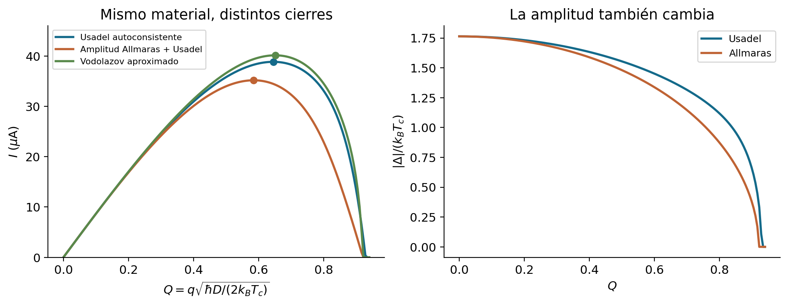

# D.0. Qué cambia en esta iteración

El objetivo es ampliar las capacidades de modelamiento de SNSPD: conectar mejor el espectro, la redistribución de energía, la respuesta del condensado y la señal eléctrica. La descripción quasiclásica proporciona herramientas para esa mejora sin exigir una reconstrucción exacta de todos los procesos de la materia condensada.

La revisión 0.2 conserva la propuesta de A–C y corrige una afirmación de alcance de la versión anterior. **El uso de corriente Usadel en el cierre modificado tiene una justificación explícita de continuidad.** Vodolazov la desarrolla mediante un término adicional en el lado derecho de la ecuación de orden; la memoria muestra su cancelación algebraica en el anexo C. La comparación entre cierres uniformes cuantifica diferencias entre aproximaciones. Por sí sola no demuestra que la corriente anterior sea inválida [M, V].

El funcional común se estudia como una ampliación útil para derivar fuerzas y almacenamiento energético con convenciones compartidas. Su beneficio debe comprobarse en los observables del detector. La versión 0.2 desarrolla la derivación desde [F], añade figuras reproducibles y explica la relación entre energía y temperatura. **En C se conserva la formulación dinámica propuesta para continuar su revisión.** Los ejemplos añadidos no introducen una nueva movilidad de producción ni una predicción nueva de latencia.

| Documento | Cambio principal de la revisión 0.2 | Pregunta que permite contestar |
|:--|:--|:--|
| A | Derivación desde [F], teorema de la envolvente explícito, corrección del juicio sobre la corriente | ¿Qué energía se varía y qué se mantiene fijo? |
| B | Figuras de reacciones, inversión térmica y poblaciones de igual energía | ¿Qué conserva un balance y qué información pierde una temperatura? |
| C | Explicación de las coordenadas energéticas y ejemplos de relajación y circuito | ¿Por qué aparece una temperatura y cómo se forma la tensión del puerto? |
| D | Síntesis, pruebas de esta versión y plan actualizado | ¿Qué está verificado y qué falta antes de cambiar producción? |

# D.1. Tres distinciones que ordenan el modelo

## D.1.1. Continuidad de corriente y energía común

La continuidad responde a una pregunta local: si entra carga en una región, ¿sale la misma carga bajo la aproximación cuasineutra? El término correctivo de Vodolazov y su implementación en la memoria atienden esta pregunta. La construcción de A responde además a otra: ¿la fuerza de amplitud y la corriente pueden calcularse como pendientes de una energía electrónica común?

Una analogía útil es una red de tuberías. Cumplir el balance de caudales en cada unión es una condición física; conocer también cuánto trabajo almacena o libera el sistema requiere una relación constitutiva adicional. La analogía solo separa las dos preguntas: no identifica corriente superconductora con flujo hidráulico ni decide qué cierre dinámico es mejor.

Para el funcional reducido de A, las identidades son

$$
\begin{gathered}
X_{|\Delta|}^{\rm FD}
=\left.\frac{\partial f_e^{\rm FD}}{\partial |\Delta|}\right|_{T,\mathbf q}
=2N_0G,\\
\boldsymbol\Pi^{\rm FD}
=\left.\frac{\partial f_e^{\rm FD}}{\partial\mathbf q}\right|_{T,|\Delta|}
=\frac{\hbar}{2e}\mathbf j_s.
\end{gathered}\tag{D.1}
$$

Su identidad de derivadas mixtas, en una rama suave y con una dirección fija de corriente, es

$$
\frac{\partial X_{|\Delta|}^{\rm FD}}{\partial q}
=\frac{\hbar}{2e}\frac{\partial j_s}{\partial|\Delta|}.
\tag{D.2}
$$

D.2 comprueba la construcción termodinámica uniforme; la conservación de carga sigue siendo una ecuación que debe cumplir el sistema espacial. Ninguna de estas pruebas, aislada, valida la movilidad, los vórtices o la latencia a baja temperatura.

## D.1.2. Energía electrónica y energía de excitaciones

La energía libre de A describe el sector electrónico efectivo: incluye el cambio asociado al emparejamiento y a las excitaciones, con referencia explícita al metal normal. No es únicamente una integral de energía de cuasipartículas ni la energía total de iones, electrones, campos y circuito.

En la extensión adiabática a ocupaciones no térmicas se usa

$$
\begin{gathered}
u_e=U_{\rm vac}(|\Delta|,q)+u_{\rm qp},\\
u_{\rm qp}=4N_0\int_0^\infty E\rho(E;|\Delta|,q)f(E)\,dE.
\end{gathered}\tag{D.3}
$$

Aquí $N_0$ es la DOS normal por espín; el factor cuatro sigue las convenciones de excitaciones positivas de A. El término de vacío superconductivo ya contiene su dependencia del superflujo. Añadir una segunda energía local del mismo superflujo contaría dos veces ese almacenamiento. Los fonones y la inductancia exterior tienen balances separados, unidos por potencias que se intercambian con signos opuestos.

## D.1.3. Coordenada energética y cierre térmico

Es posible avanzar numéricamente $u_{\rm qp}$ y consultar una temperatura equivalente cuando un coeficiente o una figura la requiera. A espectro fijo se define el mapa

$$
\begin{gathered}
u_{\rm qp}=\mathcal U(T_E;|\Delta|,q),\\
\mathcal U(T;|\Delta|,q)=4N_0\int_0^\infty
\frac{E\rho(E;|\Delta|,q)}{e^{E/(k_BT)}+1}\,dE,\\
C_{\rm qp}=\left.\partial_T\mathcal U\right|_{|\Delta|,q}>0.
\end{gathered}\tag{D.4}
$$

La inversa es única dentro del intervalo energético representado. Esto establece una correspondencia entre **dos coordenadas escalares**, con $|\Delta|$ y $q$ fijados. No establece una correspondencia entre la temperatura y todas las distribuciones posibles. Una mochila puede pesar lo mismo con contenidos diferentes; conocer el peso no determina qué objeto hay dentro. De forma análoga, la energía total no determina las poblaciones que intervienen en las fuerzas o colisiones.

Si cambia el espectro, la regla de la cadena da

$$
\dot u_{\rm qp}=C_{\rm qp}\dot T_E
+\left.\partial_{|\Delta|}\mathcal U\right|_{T_E,q}\partial_t|\Delta|
+\left.\partial_{\mathbf q}\mathcal U\right|_{T_E,|\Delta|}\cdot\dot{\mathbf q}.
\tag{D.5}
$$

Por ello ni $u_{\rm qp}$ ni $T_E$ pueden convertirse con una tabla unidimensional fija cuando varían $|\Delta|$ o $q$. Al avanzar energía electrónica total también debe contabilizarse $U_{\rm vac}$. Las formas de C en temperatura conservan utilidad para mostrar esta transformación; no obligan a seleccionar temperatura como incógnita primaria del futuro algoritmo.

La hipótesis térmica aparece al sustituir la distribución por $f_{\rm FD}(T_E)$ en las fuerzas y tasas. Esa sustitución requiere pruebas sobre corriente, fuerza, intercambio y transporte. La igualdad de energía, impuesta por D.4, no sirve como prueba independiente del cierre.

# D.2. Cómo se conectan las capas de A–C

El estado espectral temprano y el estado térmico reducido son dos representaciones con distinto contenido. El paso de una a otra se acepta cuando las magnitudes relevantes dejan de distinguirlas dentro de tolerancias declaradas.

| Capa | Variables y operaciones | Información que entrega a la siguiente capa |
|:--|:--|:--|
| Material | $D,\sigma_n,N_0,T_c,F,\alpha^2F$, convenciones de energía y modos | Escalas y pesos de transporte e interacción |
| Espectro instantáneo, A | Resolver Usadel con $|\Delta|$ y $\mathbf q$ dados | DOS y funciones anómalas; borde espectral y respuesta de corriente |
| Poblaciones, B | Evolucionar ocupaciones, fuentes, transporte y colisiones | Energía, fuerza no térmica, corriente e intercambio electrón–fonón |
| Condensado, C | Usar fuerzas y movilidad declarada; resolver continuidad | Amplitud, fase, campo eléctrico y trabajo interno |
| Exterior y circuito, C | Acoplar calor, corriente e inductancia con el dominio local | Realimentación y tensión en el puerto elegido |

## D.2.1. Balance que debe conservar cualquier reducción

Cada reacción electrón–fonón transfiere la misma energía que retira del otro subsistema. Para una celda con espectro fijo y únicamente esas colisiones,

$$
\dot u_e\big|_{e\text{-ph}}=-P_{e\text{-ph}},\qquad
\dot u_{\rm ph}\big|_{e\text{-ph}}=+P_{e\text{-ph}}.
\tag{D.6}
$$

La cancelación sobrevive a distribuciones no térmicas. Un discretizado por bandas debe retirar y añadir la misma energía por evento. Ajustar por separado dos tablas de potencia que casi coincidan es una verificación más débil que conservar esa estructura desde las reacciones.

En la extensión espacial propuesta, la energía total local satisface el balance de C.18:

$$
\begin{aligned}
\partial_t\big(u_e+K_0|\nabla|\Delta||^2+u_{\rm ph}\big)
={}&-\nabla\cdot\mathbf Q_e+\nabla\cdot\mathbf J_{\rm tr}\\
&+\mathbf j_{\rm tot}\cdot\mathbf E-P_{\rm esc}+S_\gamma^{(E)}.
\end{aligned}\tag{D.7}
$$

La corriente de transporte energético $\mathbf J_{\rm tr}$ se define en C a partir del trabajo del condensado. El campo eléctrico $\mathbf E$ es un vector y no debe confundirse con la energía espectral escalar $E$. Integrar D.7 sobre el dominio convierte las divergencias en flujos de borde: así se prueba si el dominio pequeño entrega al exterior el calor y el trabajo correctos.

La disipación del condensado de C es

$$
Q_\Delta=\Gamma_{|\Delta|}(\partial_t|\Delta|)^2
+\Gamma_\theta\left(\dot\theta+\frac{2e}{\hbar}\phi\right)^2\geq0.
\tag{D.8}
$$

Representa transferencia a los grados de libertad disipativos. No es una creación adicional de energía que se pueda sumar dos veces al balance total. La positividad de la movilidad es una condición del cierre; su magnitud y su validez durante un estado no térmico siguen pendientes de contraste.

## D.2.2. Señal que se desea modelar

Para la topología de fuente de corriente y carga física de C,

$$
\begin{gathered}
L_{\rm ext}^{\rm diff}\dot I+V_{\rm patch}=R_L(I_b-I),\\
V_{\rm port}=R_L(I_b-I).
\end{gathered}\tag{D.9}
$$

La tensión del dominio local y la del puerto pueden diferir durante la redistribución de corriente. Una respuesta calculada con resistencia prescrita sirve para entender esa diferencia y verificar el circuito; no calcula cuándo se formó dicha resistencia tras absorber un fotón.

El objetivo de desarrollo continúa siendo una absorción declarada hasta el pico de tensión previo al amplificador, con la realimentación física de la carga. Se deben distinguir el tiempo de cambio local del condensado, un phase slip, la formación de una franja resistiva, el cruce de un umbral de puerto y el pico. La revisión 0.2 no agrega una predicción de eficiencia, conteos oscuros o distribución estadística de jitter.

# D.3. Resultados reproducidos en la versión 0.2

## D.3.1. Equilibrio uniforme en Geminga

Se reejecutó un cálculo independiente del transiente de producción, usando $T=0.9$ K, $T_c=8.65$ K, $D=1.581\times10^{-4}$ m$^2$/s, $\sigma_n=4.2\times10^5$ S/m, ancho de 120 nm y espesor de 7 nm. El barrido resuelve problemas algebraicos uniformes y usa colas asintóticas de Matsubara hasta orden $\epsilon_n^{-4}$.

| Cierre uniforme | Máximo de corriente | Diferencia respecto de Usadel |
|:--|--:|--:|
| Usadel: amplitud autoconsistente y corriente | 38.850324 µA | Referencia |
| Amplitud Allmaras y corriente Usadel | 35.182843 µA | −9.44% |
| Amplitud Allmaras y corriente aproximada de Vodolazov | 40.143624 µA | +3.33% |

{width=100%}

Los tres resultados reproducen las cifras redondeadas de 0.1. Cambia su interpretación: son diferencias de cierres bajo entradas idénticas, útiles para decidir qué comparar, sin invalidar la justificación de continuidad del modelo anterior.

En el máximo Usadel se obtuvo $|\Delta|=1.040079$ meV y $E_g=0.428529$ meV, es decir $E_g/|\Delta|=0.412016$. Esta separación explica por qué los límites BCS duros en $|\Delta|$ y $2|\Delta|$ necesitan reconsiderarse cuando la corriente deprime el borde espectral. No cuantifica todavía una corrección de latencia.

| Control numérico de A | Resultado observado | Alcance de la prueba |
|:--|:--|:--|
| Matsubara de 400 a 3200 términos | Variación de $I_{\rm dep}$ menor que $7.2\times10^{-9}$ µA | Convergencia de este máximo con la cola indicada |
| Derivada de energía respecto de flujo | Error relativo máximo $1.6\times10^{-12}$ | Tres puntos de amplitud y flujo, comparados con la corriente explícita |
| Derivada de energía respecto de amplitud | Error relativo máximo $1.4\times10^{-10}$ | Mismos tres puntos, comparados con $2N_0G$ |

El script tardó aproximadamente 1.1 s en Geminga, incluida la generación de tres figuras. Es una medida de esta ejecución pequeña; no es un benchmark ni un factor de aceleración del solver del detector. Las diferencias finitas y las expresiones de corriente comparten el espectro calculado, por lo que comprueban derivadas y normalizaciones dentro de esta implementación. No constituyen dos soluciones microscópicas independientes.

## D.3.2. Pedagogía calculada de B y C

Las figuras de B y C incorporan datos nuevos de problemas pequeños y ecuaciones explícitas en sus pies. Sus valores exactos y resoluciones se registran en los archivos JSON y CSV de esta revisión. El siguiente cuadro especifica qué se contrasta.

| Ejemplo | Resultado físico que debe leerse | Límite deliberado |
|:--|:--|:--|
| Reacciones electrón–fonón | Pérdidas y ganancias energéticas se cancelan por evento | Ilustración elemental, sin espectro material DFT ejecutado |
| Inversión energética | Energía térmica monótona a espectro fijo; capacidad pequeña y mayor sensibilidad absoluta de la inversa en el extremo frío | BCS con parámetros fijados, sin promoción Eliashberg |
| Paquetes de igual energía | La fuerza depende de dónde se encuentran las excitaciones | Poblaciones sintéticas, sin simular la cascada de absorción |
| Balance detallado y límite normal | Las tasas netas se anulan en equilibrio y recuperan identidades normales | Comprueba factores y cuadraturas, no toda la cinética espacial |
| Coordenadas energía y temperatura | El cambio de variable conserva la trayectoria si se usa el Jacobiano adecuado | Modelo pequeño con condiciones declaradas en C |
| Relajación y circuito prescrito | Separan almacenamiento, disipación y respuesta eléctrica | No predicen el instante de formación de una región resistiva |

Las afirmaciones numéricas históricas que no se reejecutan aquí no se presentan como pruebas nuevas. En particular, el resultado anterior de dos momentos y los valores de una celda aislada no sustituyen la evaluación de colisiones con el espectro material real. Las conclusiones de la revisión se apoyan en los ejemplos efectivamente incluidos.

# D.4. Qué se conserva y qué se propone mejorar

## D.4.1. Material y aproximaciones

Usadel difusivo, los datos $F(\Omega)$ y $\alpha^2F(\Omega)$, la dinámica espacial y la operación subkelvin permanecen en el programa. El límite sucio y el acoplamiento débil son aproximaciones distintas. Usar un espectro de interacción material en las colisiones no convierte automáticamente un catálogo BCS en uno de equilibrio Eliashberg.

El funcional de [F], reducido en A al caso escalar y uniforme, ofrece una referencia controlable. La promoción a autoenergías dependientes de energía se justifica cuando las mediciones materiales y la sensibilidad de los observables lo requieren. No se exige resolverla como condición abstracta para toda mejora del SNSPD. Un cambio empírico de la escala del gap debe identificarse como tal y comprobarse sobre energía y corriente.

La relación $\sigma_n=2e^2N_0D$ impide ajustar independientemente los tres parámetros. Con conductividad y escala de gap fijas, la corriente uniforme depende de $\sigma_n/\sqrt D$, mientras la capacidad normal depende de $\sigma_n/D$. La calibración por corriente restringe una combinación; no valida automáticamente la otra. Además, switching y depairing no son el mismo observable en una muestra finita.

## D.4.2. Ubicación futura de los cambios

La revisión local usada como contexto es `391bb301a6c36f4438754a51a10a7fe2aade0555`. La versión 0.1 citaba otra revisión; las simulaciones de la memoria conservan su procedencia histórica propia. Esta entrega añade documentos y verificaciones aisladas, sin sustituir los módulos del solver.

| Sector de pySNSPD | Mejora que se estudiará | Comprobación antes de incorporarla |
|:--|:--|:--|
| Usadel y catálogo | Incorporar energía uniforme y conservar funciones anómalas | Derivadas, ramas, límites normal y BCS, convergencia |
| Cinética y potencias | Usar soporte espectral y factores coherentes; admitir fonones espectrales o por bandas | Balance detallado, energía por reacción y comparación de tasas |
| Dinámica de condensado | Evaluar fuerza común y mantener explícita la movilidad | Continuidad existente, relajación pequeña y núcleos espaciales |
| Evolución térmica | Avanzar energía con inversión consistente cuando sea ventajoso | Conservación, Jacobianos, condición de la inversión |
| Excitación y exterior | Declarar distribución inicial y conectar el dominio local conservativamente | Sensibilidad a transferencia inicial y tamaño del dominio |
| Circuito y diagnóstico | Fijar puerto y separar métricas de respuesta | Balance eléctrico y consistencia entre tensiones |

# D.5. Plan de desarrollo por preguntas verificables

## D.5.1. Primer paso: qué gana la energía común

Completar la discusión de A y comparar las fuerzas uniformes con el cierre de amplitud actual. Las pruebas de D.3 ya proporcionan una referencia reproducible. El siguiente contraste debe evaluar una relajación pequeña con entradas idénticas y medir qué cambia por la fuerza y qué cambia por la movilidad. Mantener separadas estas variaciones evita atribuir a la energía un efecto que provenga de cambiar a la vez el tiempo de relajación.

Se revisarán la normalización material y la identificación del espectro. La escala de corriente usada para calibrar se distinguirá de los observables reservados para validar. Una identidad termodinámica exacta dentro de una aproximación no elimina su error material.

## D.5.2. Segundo paso: qué información necesita la cinética

Usar el espectro material real en un problema 0D o espacialmente simple, con fuentes iniciales explícitas. Contrastar la distribución resuelta con la representación térmica y con candidatos de momentos o bandas. Comparar energía, fuerza, corriente, intercambio y flujo: conservar solo el primer momento no garantiza los demás.

Los umbrales de aceptación sugeridos en B, del orden de unos pocos puntos porcentuales en magnitudes relevantes, son decisiones del proyecto que se deberán ajustar al presupuesto de error. Cuando una magnitud cruza cero, el denominador de su error relativo necesita una escala física. El instante de reducción no se fija por un número universal de picosegundos.

## D.5.3. Tercer paso: cuándo importa el espacio

Probar gradientes, núcleos y continuidad en un dominio pequeño antes de absorber un fotón en una geometría completa. Revisar el límite de amplitud nula mediante una representación compleja regular. Evaluar una continuación superconductora y térmica hacia el exterior y aumentar su extensión hasta estabilizar el observable seleccionado.

La movilidad no térmica, el gradiente local con $K_0$ constante y la distribución espectral del calentamiento de B siguen siendo cierres de alcance limitado. Deben contrastarse donde influyen sobre la respuesta. La revisión pedagógica de C no los convierte en resultados microscópicos ya establecidos.

## D.5.4. Cuarto paso: una trayectoria hasta el pico

Una vez superadas las pruebas pequeñas, ejecutar una trayectoria acoplada desde la condición de transferencia de la absorción hasta el pico del puerto. Registrar balances globales, errores de catálogo, sensibilidad espacial y coste por intervalo físico. Las libertades dinámicas que se ajusten deben congelarse antes de comparar otras condiciones.

La meta de un error del 10–20% con pocas calibraciones requiere observables experimentales bien definidos, incertidumbres materiales y resultados fuera del conjunto de ajuste. La revisión 0.2 no demuestra todavía ese nivel de exactitud. Su aporte es precisar las ecuaciones, corregir su interpretación y hacer verificables los pasos previos.

# D.6. Coste computacional y reproducción

## D.6.1. Qué se midió

Se utilizó Geminga para el cálculo uniforme de A y para compilar los documentos. Los ejemplos de B y C se ejecutaron como cálculos ligeros en el equipo local. Los archivos de resultados guardan sus parámetros; el registro de A incluye el nombre de la máquina y el tiempo de ejecución. No se ejecutaron PRE, SS ni photon de producción.

El coste futuro puede escribirse esquemáticamente como

$$
W=W_{\rm catálogo}+W_{\rm campos}
+W_{\rm cinética}+W_{\rm exterior}.
\tag{D.10}
$$

Para una evaluación directa de colisiones, un término dominante escala aproximadamente como $N_{\rm cel}N_tN_EN_\Omega$. Reducir el dominio y el horizonte puede abaratar los campos; retener cinética espectral puede añadir un coste importante. No se deduce un número de horas de las pruebas de un segundo ni se promete mantener el coste de producción antes de medir esos bloques.

## D.6.2. Archivos de esta versión

Los cuatro Markdown son las fuentes editables y los PDF son su representación compilada. Las figuras se entregan también como archivos PNG y PDF. Las ecuaciones conservan las etiquetas de A–C; las adiciones utilizan sufijos cuando hace falta. Se elimina el alias innecesario de amplitud y se escribe $|\Delta|$ directamente.

El directorio `sandbox/model_v0_2` contiene los cálculos pequeños y la herramienta de compilación. `docs/modelo_v0_2/verificaciones` contiene tablas, resúmenes y un manifiesto de archivos con hashes. La guía de reproducción especifica los entornos utilizados y los comandos, sin depender de resultados ausentes de 0.1.

Cada figura declara si es un esquema pedagógico, un resultado de un modelo ilustrativo o una verificación uniforme. Los PDF originales y la memoria consultada se conservan como fuentes; no se modifican ni se incluyen en el paquete distribuible.

\newpage

# Referencias y procedencia

[M] J. A. Díaz Monge, *Modelado a múltiples escalas de la respuesta transitoria de detectores de fotones únicos de nanohilos superconductores*, `memoria_02.pdf`, 2026. Copia consultada en `/home/jdiaz/memoria/main/`, 173 páginas PDF. Anexo C, sección C.2, ecuaciones C.4–C.10, pp. impresas 121–123: justificación de continuidad del cierre modificado. Las referencias a otras secciones se detallan en A–C.

[V] D. Y. Vodolazov, *Single-Photon Detection by a Dirty Current-Carrying Superconducting Strip Based on the Kinetic-Equation Approach*, Physical Review Applied **7**, 034014 (2017). [DOI](https://doi.org/10.1103/PhysRevApplied.7.034014). [Preprint](https://arxiv.org/pdf/1611.06060), p. 11, ecuación (36) y discusión del término de corrección.

[F] P. Virtanen, A. Vargunin y M. Silaev, *Quasiclassical free energy of superconductors: Disorder-driven first-order phase transition in superconductor/ferromagnetic-insulator bilayers*, Physical Review B **101**, 094507 (2020). [DOI](https://doi.org/10.1103/PhysRevB.101.094507). Ecuación (20), p. 094507-3; [preprint v1](https://arxiv.org/pdf/1909.00992v1), ecuación (20), p. 3, con el título *Quasiclassical expressions for the free energy of superconducting systems*. La reducción empleada y sus convenciones se explican en A.

[S] A. Simon et al., *Ab initio modeling of nonequilibrium dynamics in superconducting detectors and qubits*, Physical Review B **112**, 174512 (2025). [DOI](https://doi.org/10.1103/3m2k-mzr6), [preprint](https://arxiv.org/abs/2501.13791). Marco para la futura comparación con datos y cinética materiales; no se ejecutó su cascada en las pruebas presentes.

[A] J. P. Allmaras et al., Physical Review Applied **11**, 034062 (2019). [DOI](https://doi.org/10.1103/PhysRevApplied.11.034062). Las relaciones de amplitud utilizadas en las comparaciones se especifican en A.5 y en el código local de material.

[R] Repositorio `pysnspd`, revisión local `391bb301a6c36f4438754a51a10a7fe2aade0555`, con inspección de las relaciones de material y calibración pertinentes. La identificación histórica `f3c26b95ff4e4a93504371e78b46ad3a20e06273` se conserva como procedencia de la revisión 0.1, sin atribuirla a todos los transitorios históricos.

[Q] Scripts `checks_a.py`, `checks_b.py` y `checks_c.py` de la revisión 0.2; resultados y figuras incluidos en este paquete. Las derivaciones propias y los ejemplos sintéticos se identifican en los documentos que los presentan.
